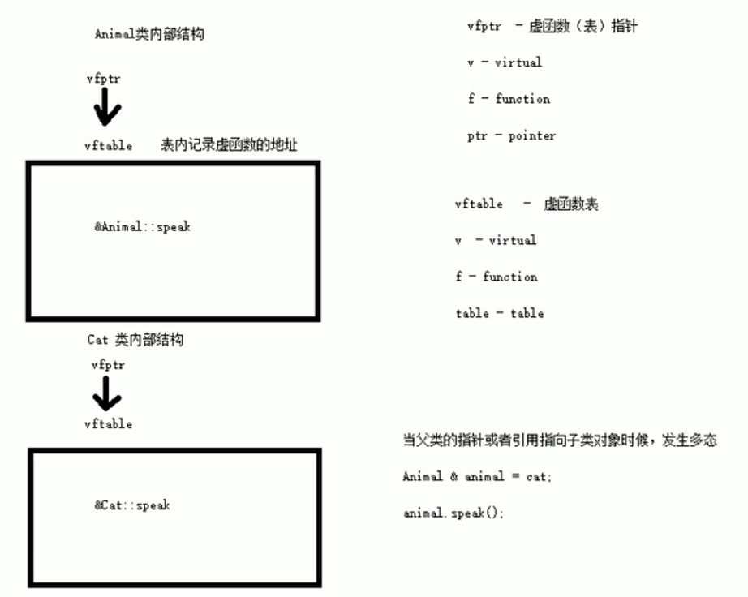

# **JUN's C++ learning**

## 1. C++简介

### 1. 面向对象编程(OOP)

在C语言的**过程性编程**中，程序是由**函数**和**过程**组成的，数据通过参数传递，逻辑通过函数调用来组织。其核心思想是将程序分解为小的、可重复使用的函数，从而提高代码的可读性、可维护性和复用性。

而C++继承了C语言的高效性和底层操作能力，并在此基础上增添了很多功能

C++引入了面向对象编程的四大基本概念：

- **类和对象**：类是数据和操作数据的函数的封装，对象是类的实例
- **继承**：子类可以继承父类的属性和方法，重用代码并增强可扩展性
- **多态**：通过函数重载和虚函数实现多态性，使得同一个函数可以有不同的行为
- **封装**：通过访问修饰符（如`private`, `protected`, `public`）控制类成员的访问权限
- **抽象**：隐藏实现细节，提供统一的接口

### 2. 泛型编程

C++支持模板（template），使得函数和类可以编写成与数据类型无关的形式，增强了代码的复用性。模板用于实现**泛型编程**，如STL（标准模板库）中的容器、迭代器等都是基于模板实现的

## 2. 基础内容

### 1. 注释

1. 单行注释：

   ```
   // 描述信息
   ```

   - 通常放在一行代码的上方，或者一条语句的末尾，对该行代码说明

2. 多行注释：

   ```
   /* 描述信息 */
   ```

   - 通常放在一段代码的上方，对该段代码做整体说明
   
### 2. 关键字

 1. **`#define`** 宏常量： `#define 常量名 常量值`
 2. **`const`**修饰的变量 `const 数据类型 常量名 = 常量值`

### 3. iostream文件

1. `cout`打印输出

   - `using`编译指令

     通过`using namespace std;`，你告诉编译器使用`std`命名空间，这样你就不需要在每次使用标准库中的内容时都加上`std::`前缀，但在大型项目中全局使用可能会带来命名冲突问题，或使代码的可读性降低

   - `std`命名空间

     `std` 是 C++ 标准库的命名空间。所有标准库中的内容都包含在这个命名空间中，如 `cout`, `cin`, `endl`, `vector`, `string` 等

   - 解决中文输出乱码问题（转化为UTF8）

     1. 引入`windows.h`，并在main函数内调用`SetConsoleOutputCP(CP_UTF8);`
     2. `main`函数内部编写`system("chcp 65001")`

   ```c++
   #include<iostream>
   #include "windows.h"
   
   int main() 
   {
   	int a = 10;
       //设置控制台输出产生的字符编码
       SetConsoleOutputCP(CP_UTF8);
       //可理解为向cout流入数据并输出
   	std::cout << "值a = " << a << std::endl;
       
   	system("pause");//使程序停止运行
   
   	return 0;
   }
   ```

2. `cin`键盘输入

   ```c++
   #include<iostream>
   #include "windows.h"
   
   int main() 
   {
   	int a;
       //设置控制台输出产生的字符编码
       SetConsoleOutputCP(CP_UTF8);
       //可理解为向a流入数据
       std::cin >> a;
   	std::cout << "输入的值" 
           	  << "a = "
          		  << a 
           	  << std::endl;
       
   	system("pause");//使程序停止运行
   
   	return 0;
   }
   ```

### 4. 数据类型

- 整形

  | **数据类型**        | **占用空间**                                    | 取值范围         |
  | ------------------- | ----------------------------------------------- | ---------------- |
  | short(短整型)       | 2字节                                           | (-2^15 ~ 2^15-1) |
  | int(整型)           | 4字节                                           | (-2^31 ~ 2^31-1) |
  | long(长整形)        | Windows为4字节，Linux为4字节(32位)，8字节(64位) | (-2^31 ~ 2^31-1) |
  | long long(长长整形) | 8字节                                           | (-2^63 ~ 2^63-1) |

- 浮点型

  | **数据类型** | **占用空间** | **有效数字范围** |
  | ------------ | ------------ | ---------------- |
  | float        | 4字节        | 7位有效数字      |
  | double       | 8字节        | 15～16位有效数字 |

- 字符型

  | **数据类型** | **占用空间** | **用法**                     |
  | ------------ | ------------ | ---------------------------- |
  | char         | 1字节        | `char ch = 'a';`             |
  | string       |              | `string 变量名 = "字符串值"` |

### 5. 程序流程结构

1. **三目运算符**

   **作用：** 通过三目运算符实现简单的判断

   **语法：**`表达式1 ? 表达式2 ：表达式3`

   **解释：**

   如果表达式1的值为真，执行表达式2，并返回表达式2的结果；

   如果表达式1的值为假，执行表达式3，并返回表达式3的结果。

   ```c++
   int main() {
     int a =10 ,b = 20 ,c = 0;
     c = a > b ? a : b;
     cout << "c = " << c << endl;
   
     //C++中三目运算符返回的是变量,可以继续赋值
   
     (a > b ? a : b) = 100;
   
     cout << "a = " << a << endl;
     cout << "b = " << b << endl;
     cout << "c = " << c << endl;
   
     return 0;
   }
   ```
   
2. **switch语句**

   作用：执行多条件分支语句

   **语法：**

   ```c++
   switch(表达式) {
   
   	case 结果1：执行语句;break;
   
   	case 结果2：执行语句;break;
   
   	...
   
   	default:执行语句;break;
   
   }
   ```
   
3. **跳转语句**

   - break语句

     **作用:** 用于跳出选择结构或者循环结构

   - continue语句

     **作用：**在循环语句中，跳过本次循环中余下尚未执行的语句，继续执行下一次循环

   - goto语句

     **作用：**可以无条件跳转语句

     **语法：** `goto 标记;`

### 6. 数组

**二维数组定义方式**

1. `数据类型 数组名[ 行数 ][ 列数 ] = { {数据1，数据2 } ，{数据3，数据4 } };`
2. `数据类型 数组名[ ][ 列数 ] = { 数据1，数据2，数据3，数据4};`

**二维数组数组名**

- 二维数组名就是这个数组的首地址
- 对二维数组名进行`sizeof`时，可以获取整个二维数组占用的内存空间大小

### 7. 函数

**函数的分文件编写**

**作用：**让代码结构更加清晰

函数分文件编写一般有4个步骤

1. 创建后缀名为`.h`的头文件
2. 创建后缀名为`.cpp`的源文件
3. 在头文件中写函数的声明
4. 在源文件中写函数的定义

## 3. 关键内容

### 1. 指针

#### 1.1 指针的基本概念

**指针的作用：** 可以通过指针间接访问内存

- 指针也是一个数据类型，在32位操作系统下指针占4个字节空间大小，不管什么数据类型
- 指针就是一个地址
- 内存编号是从0开始记录的，一般用十六进制数字表示
- 可以利用指针变量保存地址

#### 1.2 指针变量的定义和使用

指针变量定义语法： `数据类型 * 变量名；`

**示例：**

```c++
int main() {
	//1、指针的定义
	int a = 10; //定义整型变量a
	
	//指针定义语法： 数据类型 * 变量名 ;
	int * p;

	//指针变量赋值
	p = &a; //指针指向变量a的地址
	cout << &a << endl; //打印数据a的地址
	cout << p << endl;  //打印指针变量p

	//2、指针的使用,指针前面加*就是解引用，通过解引用的方法找到指针指向的内存中的数据
	cout << "*p = " << *p << endl;

	return 0;
}
```

指针变量和普通变量的区别

- 普通变量存放的是数据,指针变量存放的是地址
- 指针变量可以通过" * "操作符，操作指针变量指向的内存空间，这个过程称为解引用

> 总结1： 我们可以通过 & 符号 获取变量的地址

> 总结2：利用指针可以记录地址

> 总结3：对指针变量解引用，可以操作指针指向的内存

#### 1.3 空指针和野指针

**空指针**：指针变量指向内存中编号为0的空间

**用途：**初始化指针变量

**注意：**空指针指向的内存是不可以访问的

- 0~255之间的内存编号是系统占用的，因此不可以访问

**野指针**：指针变量指向非法的内存空间

**注意：**

- 空指针和野指针都不是我们申请的空间，因此不要访问。
- 并且存储数据需要先为数据提供空间再存储，如先定义指针指向的空间再进行数据存入
- `(int *)`可把数据强转为地址，如`pt = (int *) 0xb8000000`

#### 1.4 数组指针

**作用：**利用指针访问数组中元素

```c++
int main() {

	int arr[] = { 1,2,3,4,5,6,7,8,9,10 };

	int * p = arr;  //指向数组首地址的指针

	cout << "第一个元素： " << arr[0] << endl;
	cout << "指针访问第一个元素： " << *p << endl;

	for (int i = 0; i < 10; i++) {
		//利用指针遍历数组
		cout << *p << endl;
		p++;
	}

	return 0;
}
```

#### 1.5 函数指针

**作用：**相比值传递，利用指针作函数参数，可以修改实参的值

```c++
//值传递
void swap1(int a ,int b) {
	int temp = a;
	a = b; 
	b = temp;
    //局部变量不影响外部实参
}
//地址传递
void swap2(int * p1, int *p2) {
	int temp = *p1;
	*p1 = *p2;
	*p2 = temp;
}

int main() {
    int a = 10;
	int b = 20;
	swap1(a, b); // 值传递不会改变实参
	swap2(&a, &b); //地址传递会改变实参

	cout << "a = " << a << endl;
	cout << "b = " << b << endl;

	return 0;
}
```

> 总结：如果不想修改实参，就用值传递，如果想修改实参，就用地址传递

#### 1.6 `const`修饰指针

`const`修饰指针有三种情况

1. `const`修饰指针 — 常量指针
2. `const`修饰常量 — 指针常量
3. `const`即修饰指针，又修饰常量

```c++
int main() {
	int a = 10;
	int b = 10;

	//const修饰的是指针，指针指向可以改，指针指向的值不可以更改
	const int * p1 = &a; 
	p1 = &b; //正确
	//*p1 = 100;  报错
	
	//const修饰的是常量，指针指向不可以改，指针指向的值可以更改
	int * const p2 = &a;
	//p2 = &b; //错误
	*p2 = 100; //正确

    //const既修饰指针又修饰常量
	const int * const p3 = &a;
	//p3 = &b; //错误
	//*p3 = 100; //错误

	return 0;
}
```

### 2. 结构体

#### 2.1 结构体基本概念

结构体属于用户自定义的数据类型，允许用户存储不同的数据类型

#### 2.2 结构体定义和使用

**语法：**`struct 结构体名 { 结构体成员列表 }；`

```c++
struct student {
  //成员列表
  string name;  //姓名
  int age;      //年龄
  int score;    //分数
};

//结构体变量创建方式1
student stu;
//结构体变量创建方式2
student stu1 = { "李四",19,60 };
```

#### 2.3 结构体数组

**作用：**将自定义的结构体放入到数组中方便维护

**语法：**` struct 结构体名 数组名[元素个数] = { {} , {} , ... {} }`

```c++
//结构体定义
struct student {
	//成员列表
	string name;  //姓名
	int age;      //年龄
	int score;    //分数
}

int main() {
	//结构体数组初始化
	struct student arr[3]=
	{
		{"张三",18,80 },
		{"李四",19,60 },
		{"王五",20,70 }
	};

	return 0;
}
```

#### 2.4 结构体指针

**作用：**通过指针访问结构体中的成员

**使用结构体指针**

1. **节省内存和提高效率**：
   - 当结构体非常大时，传递结构体的副本（即按值传递）会占用大量内存并降低性能。使用结构体指针可以避免复制整个结构体，只需要传递结构体的地址，占用较少的内存
2. **动态分配内存**：
   - 结构体指针可以与动态内存分配函数（如 `malloc`）结合使用，动态创建结构体对象。这在你不知道结构体数量或大小的情况下非常有用
3. **指向结构体数组**：
   - 使用指针可以轻松操作结构体数组，特别是当你需要在函数间传递数组时，指针是必不可少的
4. **修改结构体内容**：
   - 如果你在函数中传递结构体指针，函数可以直接修改结构体中的数据，而不需要返回整个结构体（因为按值传递的话是返回副本）

**用法：**

- `struct student * p = &stu`   指针指向结构体变量
- 利用操作符 `-> `可以通过结构体指针访问结构体属性

```c++
//结构体定义
struct student {
	//成员列表
	string name;  //姓名
	int age;      //年龄
	int score;    //分数
};


int main() {
	struct student stu = { "张三",18,100, };
	struct student * p = &stu;
	
	p->score = 80; //指针通过 -> 操作符可以访问成员

	cout << "姓名：" << p->name << " 年龄：" << p->age << " 分数：" << p->score << endl;

	return 0;
}
```

#### 2.5 结构体做函数参数

**作用：**将结构体作为参数向函数中传递

传递方式有两种：

- 值传递
- 地址传递

```c++
//学生结构体定义
struct student {
	//成员列表
	string name;  //姓名
	int age;      //年龄
	int score;    //分数
};

//值传递
void printStudent(student stu ) {
	stu.age = 28;
	cout << "子函数中 姓名：" << stu.name << " 年龄： " << stu.age  << " 分数：" << stu.score << endl;
}

//地址传递
void printStudent2(student *stu) {
	stu->age = 28;
	cout << "子函数中 姓名：" << stu->name << " 年龄： " << stu->age  << " 分数：" << stu->score << endl;
}

int main() {
	student stu = { "张三",18,100};
	//值传递
	printStudent(stu);
	cout << "主函数中 姓名：" << stu.name << " 年龄： " << stu.age << " 分数：" << stu.score << endl;

	cout << endl;

	//地址传递
	printStudent2(&stu);
	cout << "主函数中 姓名：" << stu.name << " 年龄： " << stu.age  << " 分数：" << stu.score << endl;

	return 0;
}
```

> 总结：如果不想修改主函数中的数据，用值传递，反之用地址传递

#### 2.6 结构体中`const`使用场景

**作用：**用`const`来防止误操作

```c++
//const使用场景
void printStudent(const student *stu) //加const防止函数体中的误操作
{
	//stu->age = 100; //操作失败，因为加了const修饰
	cout << "姓名：" << stu->name << " 年龄：" << stu->age << " 分数：" << stu->score << endl;

}
```

### 3. 内存分区模型

#### 3.1 内存分区

C++程序在执行时，将内存大方向划分为**4个区域**

- **代码区：**存放函数体的二进制代码，由操作系统进行管理的

- **全局区：**存放全局变量和静态变量以及常量,还包含常量区（`const`修饰的）

- **栈区：**

  由编译器自动分配释放, 存放函数的参数值,局部变量等

  如局部变量存放在栈区，执行完该函数将自动释放（编译器会保留一次局部变量，第二次将不再保留），不能返回局部变量的值，为非法行为

- **堆区：**

  由程序员分配和释放,若程序员不释放,程序结束时由操作系统回收

  在C++中主要利用new在堆区开辟内存，堆区开辟的数据，由程序员手动开辟，手动释放，释放利用操作符 delete

#### 3.2 new操作符

C++中利用new操作符在堆区开辟数据

堆区开辟的数据，由程序员手动开辟，手动释放，释放利用操作符 delete

**语法：**` new 数据类型`

利用new创建的数据，会返回该数据对应的类型的指针

`int* ptr = new int(10);`
`new int(10)` 分配了一个 `int` 类型的内存空间，并初始化为 10。
`ptr` 保存了分配的内存空间的首地址，也就是指向这个 `int` 类型的内存区域

**示例1： 基本语法**

```c++
int* func() {
	int* a = new int(10);
	return a;
}

int main() {
    //在堆区开辟内存
	int *p = func();

	cout << *p << endl;
	cout << *p << endl;

	//利用delete释放堆区数据
	delete p;

	//cout << *p << endl; //报错，释放的空间不可访问

	return 0;
}
```

**示例2： 开辟数组**

```c++
//堆区开辟数组
int main() {
    //创建10个元素数组的空间，在堆区，arr存放该数组内存的首地址
	int* arr = new int[10];

	for (int i = 0; i < 10; i++)
	{
		arr[i] = i + 100;
	}

	for (int i = 0; i < 10; i++)
	{
		cout << arr[i] << endl;
	}
	//释放数组 delete 后加 []
	delete[] arr;

	return 0;
}
```

### 4. 引用

#### 4.1 引用的基本概念

本质：**引用的本质在c++内部实现是一个指针常量.**

在 C++ 中，**引用（Reference）** 是一种为变量创建别名的机制，允许程序员通过多个名字访问同一个内存位置。引用的基本概念和指针类似，但使用起来更为简洁，并且引用一旦初始化就不能再指向其他内存，但指针可以。

#### 4.2 引用的定义和使用

**作用： **引用是某个已存在变量的别名，定义时使用 `&` 符号

**语法：** `数据类型 &别名 = 原名`

```c++
int a = 10;
int &ref = a;  // ref 是 a 的引用
```

在这段代码中，`ref` 是变量 `a` 的引用，它和 `a` 指向的是同一块内存。对 `ref` 的任何操作都相当于对 `a` 进行操作

**注意事项：**

- **必须初始化**：引用在定义时必须绑定到一个变量，不能留空
- **不可更改绑定**：一旦引用初始化，它就无法再指向其他变量
- **没有 NULL 引用**：引用总是必须指向一个合法的变量或对象，不能指向空值。不同于指针，引用不能是 `nullptr`

#### 4.3 引用做函数参数

**作用：**函数传参时，可以利用引用的技术让形参修饰实参，避免复制大对象，提高效率

**优点：**可以简化指针修改实参

**按值传递：**函数会复制传递进来的变量值，函数内部对参数的修改不会影响原始变量

**引用传递：**通过传递引用，函数能够直接操作传入的变量，不会进行拷贝，节省内存并提高效率任何在函数内部对引用的修改，都会直接反映在调用者的变量上(可以理解为指针中对地址指向的内容进行修改，而不是值传递中的先拷贝值再存储)

```c++
//1. 值传递
void mySwap01(int a, int b) {
	int temp = a;
	a = b;
	b = temp;
}

//2. 地址传递
void mySwap02(int* a, int* b) {
	int temp = *a;
	*a = *b;
	*b = temp;
}

//3. 引用传递
void mySwap03(int& a, int& b) {
	int temp = a;
	a = b;
	b = temp;
}

int main() {
	int a = 10;
	int b = 20;

	mySwap01(a, b);
	cout << "a:" << a << " b:" << b << endl;

	mySwap02(&a, &b);
	cout << "a:" << a << " b:" << b << endl;

	mySwap03(a, b);
	cout << "a:" << a << " b:" << b << endl;

	return 0;
}
```

> 总结：通过引用参数产生的效果同按地址传递是一样的。引用的语法更清楚简单

#### 4.4 引用做函数返回值

作用：引用是可以作为函数的返回值存在的，可以通过返回引用使函数返回的值可直接修改

用法：函数调用作为左值

**注意：**

- 当函数返回引用时，函数返回的是对象的地址或内存中的位置，而不是该对象的副本
- 调用者可以直接对返回的对象进行操作，修改它的内容
- 返回引用可以避免对象的拷贝开销，提升性能
- 需要注意的是**不要返回局部变量**引用，返回局部变量的引用会导致未定义行为，因为返回的引用指向的内存已经无效
- 还可以通过**static(全局区)**延续局部变量的生命周期，从而实现函数内变量的返回

```c++
//可以理解为int& getElement(int arr[], int index) = arr[index]，getElement()为arr[index]别名
int& getElement(int arr[], int index) {
    return arr[index];  // 返回数组元素的引用
}
int main() {
	int myArray[5] = {1, 2, 3, 4, 5};
    
    getElement(myArray, 2) = 10;  // 直接修改数组中的第三个元素
 
	cout << "myArray[2]:" << myArray[2] << endl;
	return 0;
}
```

#### 4.5 常量引用

**作用：**常量引用主要用来修饰形参，防止误操作

在函数形参列表中，可以加const修饰形参，防止形参改变实参

```c++
//引用使用的场景，通常用来修饰形参,const：只读类型
void showValue(const int& v) {
	//v += 10;
	cout << v << endl;
}

int main() {
	//int& ref = 10;  引用本身需要一个合法的内存空间，因此这行错误
	//加入const就可以了，编译器优化代码，int temp = 10; const int& ref = temp;
	const int& ref = 10;

	//ref = 100;  //加入const后不可以修改变量
	cout << ref << endl;

	//函数中利用常量引用防止误操作修改实参
	int a = 10;
	showValue(a);
    
	return 0;
}
```

#### **4.6 将引用用于结构**

在 C++ 中，引用不仅可以用于基本数据类型，也可以用于自定义的复杂数据类型，例如结构体（`struct`）

通过引用传递结构体对象，可以避免拷贝整个结构体。以下是通过引用传递 `Point` 结构体的示例：

```c++
#include <iostream>

struct Point {
    int x;
    int y;
};

// 使用引用作为参数
void movePoint(Point &p, int dx, int dy) {
    p.x += dx;
    p.y += dy;
}

int main() {
    Point p1 = {10, 20};
    
    // 使用引用传递，避免拷贝
    movePoint(p1, 5, -3);
    
    std::cout << "p1.x: " << p1.x << ", p1.y: " << p1.y << std::endl;  // 输出: p1.x: 15, p1.y: 17
    
    return 0;
}

```

#### 4.7 将引用用于类对象


### 5. 类和对象

#### 5.1 类和对象的基本概念

在C++中，**类和对象**是面向对象编程（OOP）的核心概念。通过类和对象，C++提供了一种模块化的、抽象的编程方式

1. **类 (Class)**

   **类**是一个用户定义的数据类型，它封装了数据和操作数据的函数（称为方法或成员函数）。类是对现实世界实体的抽象，定义了对象的属性和行为。

   **类的基本结构：**

   ```c++
   class ClassName {
   public:
       // 类声明
       // 构造函数
       ClassName();
   
       // 成员变量 (属性)
       int attribute1;
       double attribute2;
   
       // 成员函数 (行为)
       void method1();
       int method2(int param);
   };
   ```

   - **成员变量：**类中的数据（属性），定义了对象的状态。

   - **成员函数：**类中的函数（行为），定义了对象可以执行的操作。

2. **对象 (Object)**

   **对象**是类的实例化。类是一个模板，而对象是根据类创建的具体实例。通过对象，能够访问类的成员变量和成员函数。

   在C++中，可以通过类来**创建对象**，使用**构造函数**来初始化对象的属性。

**创建对象：**

```c++
int main() {
    // 使用类创建对象
    Person person1("Alice", 25);
    Person person2("Bob", 30);

    // 调用对象的成员函数
    person1.introduce();
    person2.introduce();

    return 0;
}
```

3. **类和对象的关系**

   - **类是模板**：类定义了对象的属性和行为，但不具体占用内存，直到创建对象时才分配内存。
   - **对象是类的实例**：对象是具体的，通过类定义的结构，可以对对象进行操作和使用。


> C++面向对象的三大特性为：封装、继承、多态

#### 5.2 封装

1. **封装的意义**

   **封装**（Encapsulation）是面向对象编程的一个核心原则

   - 将数据（成员变量）和操作数据的函数（成员函数）捆绑在一起

   - 通过访问控制来隐藏类的内部实现细节，只允许外部通过特定的接口访问这些数据。

   | **访问权限**        | 类内         | 类外                                             |
   | ------------------- | ------------ | ------------------------------------------------ |
   | public(公共权限)    | 类内可以访问 | 类外可以访问                                     |
   | protected(保护权限) | 类内可以访问 | 类外不可以访问(但子类可以访问父类中的保护内容)   |
   | private(私有权限)   | 类内可以访问 | 类外不可以访问(但子类不可以访问父类中的私有内容) |

   **示例：**

   ```c++
   class BankAccount {
   private:
       double balance;  // 余额是私有的，不能直接访问
   
   public:
       void deposit(double amount) 
       {
           if (amount > 0) balance += amount;  // 确保存款为正数
       }
   
       void withdraw(double amount) 
       {
           if (amount > 0 && amount <= balance) balance -= amount;  // 确保取款合法
       }
   
       double getBalance() const 
       {
           return balance;
       }
   };
   ```

   在这个例子中，`balance`是私有的，外部代码不能直接访问或修改。只能通过`deposit()`和`withdraw()`方法来操作账户余额，这样确保了余额的合理性和安全性。

   > **类比**：把封装看作是一个“黑箱”操作，外部只需要使用类提供的功能，而无需了解其内部的实现过程

2. **struct和class区别**

   在C++中 struct和class唯一的**区别**就在于 **默认的访问权限不同**

   **区别：**

   - struct 默认权限为公共
   - class 默认权限为私有

#### 5.3 对象的初始化和清理

C++中的面向对象来源于生活，每个对象也都会有初始设置以及对象销毁前的清理数据的设置

对象的**初始化和清理**也是两个非常重要的安全问题

 一个对象或者变量没有初始状态，对其使用后果是未知

 同样的使用完一个对象或变量，没有及时清理，也会造成一定的安全问题

c++利用了**构造函数**和**析构函数**解决上述问题，这两个函数将会被编译器自动调用，完成对象初始化和清理工作。

对象的初始化和清理工作是编译器强制要我们做的事情，因此如果**我们不提供构造和析构，编译器会提供**，**编译器提供的构造函数和析构函数是空实现**

##### **5.3.1 构造函数和析构函数**

1. **对象的初始化：构造函数 (Constructor)**

   构造函数是一个特殊的成员函数，用于在对象创建时进行初始化。它的名字与类名相同，且没有返回类型（即使是`void`也不写）。构造函数可以有参数，也可以没有参数（称为**默认构造函数**）

   - **构造函数语法：**`类名(){}`

   - **构造函数的特点：**
     - 名字与类名相同
     - 没有返回类型
     - 在对象创建时自动调用，不需要显式调用
     - 可以被重载，即可以定义多个构造函数（不同的参数）

   - **构造函数使用示例：**

   ```c++
   #include <iostream>
   using namespace std;
   
   class Person {
   private:
       string name;
       int age;
   
   public:
       // 默认构造函数
       Person() {
           name = "Unknown";
           age = 0;
           cout << "Default constructor called!" << endl;
       }
   
       // 带参数的构造函数
       Person(string n, int a) {
           name = n;
           age = a;
           cout << "Parameterized constructor called!" << endl;
       }
       
       //拷贝构造函数
   	Person(const Person& p) {
           name = p.name;
   		age = p.age;
   		cout << "copy constructor called!" << endl;
   	}
   
       // 成员函数
       void introduce() {
           cout << "Hi, I'm " << name << " and I'm " << age << " years old." << endl;
       }
   };
   
   int main() {
       // 使用默认构造函数
       Person person1;
       person1.introduce();
   
       // 使用带参数的构造函数
       Person person2("Alice", 30);
       person2.introduce();
       
       // 使用拷贝构造函数
       Person person3(person2);
   	person3.introduce();
       
       return 0;
   }
   
   ```

   - **三种构造函数：**

     1. **默认构造函数**：不接受任何参数，初始化`name`为`"Unknown"`，`age`为`0`。

     2. **带参数的构造函数**：接受两个参数`n`和`a`，用于初始化`name`和`age`。

     3. **拷贝构造函数**：拷贝一个已经创建完毕的对象`person2`来初始化一个新对象`person3`的`name`和`age`

        拷贝构造函数调用时机通常有三种情况：

        - 使用一个已经创建完毕的对象来初始化一个新对象
        - 值传递的方式给函数参数传值
        - 以值方式返回局部对象

   - **构造函数调用规则：**

     默认情况下，c++编译器至少给一个类添加3个函数

     1．默认构造函数(无参，函数体为空)

     2．默认析构函数(无参，函数体为空)

     3．默认拷贝构造函数，对属性进行值拷贝

     构造函数调用规则如下：

     - 如果用户**定义有参构造函数**，c++不在提供默认无参构造（故需要用户自定义默认无参构造），但是会提供默认拷贝构造
     - 如果用户**定义拷贝构造函数**，c++不会再提供其他构造函数

   - **构造函数的作用：**
     
     - **对象的初始化：**构造函数通常用于为类的成员变量赋初值。如：如果类包含指针或其他资源，构造函数可以为其分配内存或进行初步设置。
     - **提供默认行为：**如果没有显式定义构造函数，C++编译器会提供一个默认构造函数，用于不接受任何参数的对象初始化。
     - **构造函数重载：**构造函数可以被重载，意味着可以为不同的构造方式提供多个构造函数。如：可以为带参数和不带参数的对象创建不同的构造函数。
     - **复杂对象的初始化：**构造函数可以用于复杂的初始化过程，比如为对象的成员分配动态内存，或通过传递参数来初始化某些特定属性。
     - **初始化列表：**构造函数可以使用初始化列表(initializer list)来对常量成员（const）、引用成员（&）或需要提前初始化的成员进行初始化。

2. **对象的清理：析构函数 (Destructor)**

   析构函数是一个特殊的成员函数，它用于在对象的生命周期结束时释放资源或执行清理操作。析构函数的名字是在类名前加上波浪号（`~`），且没有返回类型和参数。它在对象被销毁时**自动调用**。

   - **析构函数语法：**`~类名(){}`
   - **析构函数特点：**
     - 名字与类名相同，前面有一个波浪号（`~`）
     - 没有返回类型，也不能有参数
     - 当对象生命周期结束时（如对象超出作用域或显式删除时）自动调用
     - 主要用于释放资源，例如内存、文件句柄或网络连接等

   - **析构函数使用示例：**

     ```c++
     #include <iostream>
     using namespace std;
     
     class Person {
     private:
         string name;
         int age;
     
     public:
         // 构造函数
         Person(string n, int a) {
             name = n;
             age = a;
             cout << "Constructor called for " << name << endl;
         }
     
         // 析构函数
         ~Person() {
             cout << "Destructor called for " << name << endl;
         }
     
         // 成员函数
         void introduce() {
             cout << "Hi, I'm " << name << " and I'm " << age << " years old." << endl;
         }
     };
     
     void Local_Object() {
         // 创建局部对象
         Person person1("person1", 30);
         person1.introduce();
     } // person1超出作用域时，析构函数会被自动调用
     
     int main() {
         Local_Object();
         Person person2("person2", 40);
         person2.introduce();
     
         return 0; // 程序结束时，person2的析构函数会被调用
     }
     
     ```

     > **在该例中：**
     >
     > **构造函数**：用于初始化对象，创建`person1`和`person2`时分别调用了构造函数。
     >
     > **析构函数**：用于清理对象，`person1`在其生命周期结束时调用析构函数，`person2`在`main`函数结束时调用析构函数。

   - **析构函数的作用：**
     - **释放资源：**如果对象在使用过程中占用了某些资源(如动态分配的内存)，析构函数的主要任务就是释放这些资源，防止内存泄漏。
     - **自动清理：**析构函数可以确保对象在作用域结束时进行自动清理，程序员不需要手动处理资源的释放，减少了出错的可能性。
     - **避免内存泄漏：**类内部使用了动态内存分配（如new），需要在析构函数中释放这些资源（用delete）。
     - **栈对象的清理：**对于栈上的对象（局部变量），当它**超出作用域**时，**析构函数自动被调用**。

##### 5.3.2 **深拷贝与浅拷贝**

1. **浅拷贝（Shallow Copy）**

   - **浅拷贝定义：**浅拷贝是指在复制对象时，只复制**对象的基本成员变量**（包括指针的值），而不复制指针指向的实际资源。换句话说，浅拷贝只是将指针地址复制给新对象，两个对象共享同一块内存资源。

   - **浅拷贝特点：**
     - 浅拷贝会直接复制对象的成员变量，包括指针的地址值。
     - 两个对象的指针指向相同的内存区域，修改其中一个对象的指针成员，会影响另一个对象。
     - 当两个对象销毁时，都试图释放同一块内存，可能会导致**重复释放**（double-free）错误。

   - **浅拷贝示例：**

     ```c++
     #include <iostream>
     using namespace std;
     
     class Shallow {
     public:
         int* data;
     
         // 构造函数
         Shallow(int value) {
             data = new int(value);  // 动态分配内存
         }
     
         // 默认的复制构造函数实现浅拷贝
         Shallow(const Shallow& other) {
             data = other.data;  // 只复制指针，两个对象共享同一块内存
             cout << "Shallow copy constructor called!" << endl;
         }
     
         // 析构函数
         ~Shallow() {
             delete data;  // 释放指针指向的内存
             cout << "Destructor called!" << endl;
         }
     };
     
     int main() {
         Shallow obj1(10);     // obj1创建并分配内存
         Shallow obj2 = obj1;  // 复制obj1到obj2，浅拷贝
     
         cout << "obj1 data: " << *obj1.data << endl;  // 输出：10
         cout << "obj2 data: " << *obj2.data << endl;  // 输出：10
     
         return 0;  // 可能导致内存错误，因为析构函数将尝试两次释放同一内存
     }
     
     ```

     > 在这个例子中，`obj1`和`obj2`共享同一块内存，因为复制构造函数实现了浅拷贝。当`obj1`和`obj2`超出作用域时，两个对象的析构函数都会调用`delete data`，从而导致**重复释放内存**，产生错误。

2. **深拷贝（Deep Copy）**

   - **深拷贝定义：**深拷贝是指在复制对象时，不仅复制对象的成员变量，还**复制指针指向的实际数据**（即为新对象分配新的内存空间，并复制原对象中的数据）。这样，两个对象各自拥有独立的资源，互不影响。

   - **深拷贝特点：**

     - 深拷贝会为新对象分配独立的内存，并复制原对象指针指向的实际数据。

     - 修改新对象的成员不会影响原对象，两个对象完全独立。

     - 当对象销毁时，它们各自释放自己占用的内存资源，不会出现重复释放的错误。

   - **深拷贝示例：**

     ```c++
     #include <iostream>
     using namespace std;
     
     class Deep {
     public:
         int* data;
     
         // 构造函数
         Deep(int value) {
             data = new int(value);  // 动态分配内存
         }
     
         // 深拷贝的复制构造函数
         Deep(const Deep& other) {
             data = new int(*other.data);  // 分配新内存，并复制数据
             cout << "Deep copy constructor called!" << endl;
         }
     
         // 析构函数
         ~Deep() {
             delete data;  // 释放指针指向的内存
             cout << "Destructor called!" << endl;
         }
     };
     
     int main() {
         Deep obj1(20);     // obj1创建并分配内存
         Deep obj2 = obj1;  // 复制obj1到obj2，深拷贝
     
         cout << "obj1 data: " << *obj1.data << endl;  // 输出：20
         cout << "obj2 data: " << *obj2.data << endl;  // 输出：20
     
         *obj2.data = 50;  // 修改obj2的数据
     
         cout << "After modification:" << endl;
         cout << "obj1 data: " << *obj1.data << endl;  // 输出：20（obj1保持不变）
         cout << "obj2 data: " << *obj2.data << endl;  // 输出：50（obj2被修改）
     
         return 0;
     }
     
     ```

     > 在这个例子中，`Deep`类的复制构造函数实现了深拷贝。`obj1`和`obj2`**各自拥有独立的内存空间**，修改`obj2`的值不会影响`obj1`。当两个对象销毁时，各自的内存会被正确释放，不会发生内存错误。

   - **深拷贝与浅拷贝的对比**

     | 特性           | 浅拷贝 (Shallow Copy)                                  | 深拷贝 (Deep Copy)                             |
     | -------------- | ------------------------------------------------------ | ---------------------------------------------- |
     | **内存分配**   | 只复制指针的地址，两个对象**共享**同一块内存           | 分配**新的内存**，并复制原对象的数据           |
     | **资源独立性** | 对象**共享资源**，修改一个对象会影响另一个对象         | 对象拥有独立资源，**互不影响**                 |
     | **资源管理**   | 可能导致资源管理问题，如内存泄漏或重复释放             | 资源独立管理，不会出现重复释放或资源泄漏的风险 |
     | **效率**       | 较快，因为只复制指针地址，不复制实际数据               | 较慢，因为需要分配内存并复制数据               |
     | **使用场景**   | 适用于无需独立管理内存或资源的情况，如简单的结构体对象 | 适用于需要独立管理内存或资源的复杂对象         |

> 总结：如果属性有在堆区开辟的，一定要自己提供拷贝构造函数，防止浅拷贝带来的问题

##### 5.3.3 **初始化列表**

**作用：**C++提供了初始化列表语法，用来初始化属性

**语法：**`构造函数()：属性1(值1),属性2（值2）... {}`

**示例：**

```c++
class Person {
public:
	////传统方式初始化
	//Person(int a, int b, int c) {
	//	m_A = a;
	//	m_B = b;
	//	m_C = c;
	//}

	//初始化列表方式初始化
	Person(int a, int b, int c) :m_A(a), m_B(b), m_C(c) {}
	void PrintPerson() {
		cout << "mA:" << m_A << endl;
		cout << "mB:" << m_B << endl;
		cout << "mC:" << m_C << endl;
	}
private:
	int m_A;
	int m_B;
	int m_C;
};

int main() {
    
	Person p(1, 2, 3);
	p.PrintPerson();

	return 0;
}
```

##### 5.3.4 **类对象作为类成员**

C++类中的成员可以是另一个类的对象，我们称该成员为**对象成员**

1. **类对象作为类成员的基本概念**

   当一个类的成员是另一个类的对象时，会出现两个重要的特性：

   - **对象的构造顺序**：当**对象成员**创建时，类成员对象会先于**对象成员**进行构造。

   - **对象的析构顺序**：当**对象成员**销毁时，类成员对象会在**对象成员**之后销毁。

   ```c++
   #include <iostream>
   
   // 定义一个类Address
   class Address {
   public:
       // 创建string类对象(std::string 是C++标准库提供的一个用于表示和操作字符串的类)
       std::string city;
       std::string street;
   	// 构造函数初始化列表
       Address(const std::string& city, const std::string& street)
           : city(city), street(street) {
           std::cout << "Address Constructor: " << city << ", " << street << std::endl;
       }
   
       ~Address() {
           std::cout << "Address Destructor" << std::endl;
       }
   };
   
   // 定义一个类Contact，它包含Address对象
   class Contact {
   public:
       Address address;  // Address类对象作为成员
   	// 构造函数初始化列表
       Contact(const std::string& city, const std::string& street)
           : address(city, street) {
           std::cout << "Contact Constructor" << std::endl;
       }
   
       ~Contact() {
           std::cout << "Contact Destructor" << std::endl;
       }
   };
   
   int main() {
       Contact contact("New York", "5th Avenue");
       return 0;
   }
   
   ```

   > **注意：**类成员的初始化顺序总是按照类声明(类中的定义)中的顺序进行，而不是初始化列表中的顺序。
   >
   > **注意：**当类中包含类对象作为成员时，这些成员**必须**在构造函数的初始化列表中显式地初始化，特别是当这些成员没有默认构造函数时

##### 5.4.5 静态成员

**静态成员**（`static` member）包括**静态成员变量**和**静态成员函数**。

1. **静态成员变量**

   - **共享性**：静态成员变量是类的所有对象共享的，而不是每个对象单独拥有一份。也就是说，不管创建了多少个类的对象，所有对象共享同一个静态成员变量。

   - **独立于对象存在**：静态成员变量在程序启动时就已经存在，直到程序结束时才被销毁。它独立于任何类的对象，不依赖于对象的创建与销毁。

   - **类外定义**：静态成员变量的声明在类内部，但必须在类的外部进行初始化。

   **语法：**

   ```c++
   class MyClass {
   public:
       static int staticVar; // 静态成员变量的声明
   };
   
   // 类外定义和初始化
   int MyClass::staticVar = 0; // 静态成员变量的定义和初始化
   ```

   > 由于静态成员变量是类的所有对象共享的，而不是每个对象单独拥有一份，所以可以直接通过类名访问

   **示例：**

   ```c++
   class Person
   {
   
       public:
       static int m_A; //静态成员变量
       //静态成员变量特点：
       //1 在编译阶段分配内存
       //2 类内声明，类外初始化
       //3 所有对象共享同一份数据
   
       private:
       static int m_B; //静态成员变量也是有访问权限的
   };
   // 静态成员变量初始化
   int Person::m_A = 10;
   int Person::m_B = 10;
   
   void test01()
   {
       //静态成员变量两种访问方式
   
       //1、通过对象
       Person p1;
       p1.m_A = 100;
       cout << "p1.m_A = " << p1.m_A << endl;
   
       Person p2;
       p2.m_A = 200;
       cout << "p1.m_A = " << p1.m_A << endl; //共享同一份数据
       cout << "p2.m_A = " << p2.m_A << endl;
   
       //2、通过类名
       cout << "m_A = " << Person::m_A << endl;
   
   
       //cout << "m_B = " << Person::m_B << endl; //私有权限访问不到
   }
   
   int main() {
   
       test01();
   
       return 0;
   }
   ```

   > 在上面的例子中，`Person::m_A` 是一个静态成员变量，所有的 `Person` 对象都共享这一变量。每次创建或销毁对象，`m_A` 值的改变，都会影响到所有对象，因为静态变量在所有对象间共享。

2. **静态成员函数**

   - **只能访问静态成员变量**：静态成员函数**不能访问**类的**非静态**成员变量或非静态成员函数，因为它们与具体对象无关，而是属于整个类。
   - **不需要对象即可调用**：可以直接**通过类名**调用静态成员函数，而不需要通过类的对象。
   - 作用域解析运算符 `::` 用于明确指定要访问的成员或类，尤其在存在命名冲突时。

   **语法：**

   ```c++
   class MyClass {
   public:
       static void staticFunc();  // 静态成员函数声明
   };
   
   // 静态成员函数定义
   void MyClass::staticFunc() {
       std::cout << "This is a static function." << std::endl;
   }
   ```

   **示例：**

   ```c++
   #include <iostream>
   
   class MyClass {
   public:
       static int staticVar;
   
       static void showStaticVar() {
           std::cout << "Static Variable: " << staticVar << std::endl;
       }
   
       void setStaticVar(int val) {
           staticVar = val;  // 非静态成员函数也可以修改静态变量
       }
   };
   
   // 静态成员变量初始化
   int MyClass::staticVar = 0;
   
   int main() {
       MyClass::showStaticVar();  // 调用静态成员函数，输出：Static Variable: 0
   
       MyClass obj;
       obj.setStaticVar(100);     // 使用对象修改静态变量
       MyClass::showStaticVar();  // 调用静态成员函数，输出：Static Variable: 100
   
       MyClass::staticVar = 200;  // 使用类名直接修改静态变量
       MyClass::showStaticVar();  // 调用静态成员函数，输出：Static Variable: 200
   
       return 0;
   }
   ```

   > 在此例中，`MyClass::staticVar` 是静态成员变量，`MyClass::showStaticVar()` 是静态成员函数。静态成员函数可以通过类名直接调用，而不需要对象，也可以通过对象访问。静态函数只能访问静态成员变量。

3. **静态成员的存储和生命周期**

   - 静态成员变量**存储在全局区**，与普通的成员变量存储在对象的内存区域不同，静态成员变量是全局共享的，生命周期从程序开始到结束。
   - 静态成员函数与普通成员函数不同，它们没有 `this` 指针，因为它们与具体对象无关。
   - 类内的成员变量和成员函数分开存储，只有**非静态成员变量**才属于类的对象上

##### 5.4.6 this指针

1. **this指针概念**

   由于成员变量和成员函数是分开存储的，所以每一个非静态成员函数只会诞生一份函数实例，也就是说多个同类型的对象会共用一块代码

   为了这一块代码能区分哪个对象调用的自己，c++提供了特殊的对象指针，this指针。

   **this指针：**一个隐式传递给每个非静态成员函数的指针，指向调用该成员函数的对象自身。它的主要作用是让成员函数能够访问调用它的对象的成员变量和其他成员函数。**其只存在于非静态成员函数中**，this指针**不需要定义**，直接使用即可。

2. **this指针用途**

   - **避免成员变量和参数名冲突**

     当构造函数或成员函数的参数名称与成员变量同名时，使用 `this->` 来区分成员变量和局部变量

     ```c++
     class MyClass {
     public:
         int x;
     
         MyClass(int x) {
             this->x = x;  // 使用 this->x 表示成员变量 x，避免与参数 x 混淆
         }
     };
     ```

     > **`this` 是一个指针**，指向当前调用成员函数的对象的地址。它不直接存储对象成员的地址，而是存储**整个对象的地址**
     >
     > **`this->x`** 是通过 `this` 指针访问当前对象的成员变量 `x`，而 `->` 运算符是用于**通过指针访问成员**的工具

   - **在类的非静态成员函数中返回对象本身**

     `return *this` 是指返回当前对象的引用。函数返回 `*this` 时，函数返回值是当前对象的引用，而不是返回当前对象的副本。这种用法在实现链式调用时非常有用

     **示例：链式调用**

     链式调用（chained calls）是一种设计模式，允许你通过连续调用同一个对象的方法，简化代码的书写。

     ```c++
     #include <iostream>
     
     class MyClass {
     private:
         int x;
     
     public:
         // 构造函数
         MyClass(int val) : x(val) {}
     
         // 设置值的函数，返回当前对象的引用
         MyClass& setValue(int x) {
             this->x += x;
             return *this;  // 返回当前对象的引用
         }
     
         void show() {
             std::cout << "x = " << x << std::endl;
         }
     };
     
     int main() {
         MyClass obj(10);
     
         obj.setValue(20).setValue(30);  // 链式调用
         obj.show();  // 输出：x = 30
     
         return 0;
     }
     
     ```

     **解释：**

     - `setValue()` 函数将成员变量 `x` 设置为指定值，然后通过 `return *this` 返回当前对象的引用。
     - 因为返回了对象的引用，所以可以连续调用 `setValue()`，实现链式调用。
     - `obj.setValue(20).setValue(30)`的含义是：
       1. `setValue(20)` 将 `x` 增加 `20`，并返回 `obj` 的引用。
       2. `setValue(30)` 对返回的对象调用，再次将 `x` 增加 `30`，最终相加得60。

3. **this指针注意事项**

   - **静态成员函数中没有 `this` 指针**：因为静态成员函数不与任何特定对象相关联，因此没有 `this` 指针。静态函数只能访问静态成员变量和其他静态函数。
   - **不能修改 `this` 的值**：`this` 是一个常量指针（`MyClass* const this`），它指向当前对象的地址，可以通过指针修改对象的数据，但不能修改 `this` 本身指向的对象
   - **`this` 是一个指针**，指向当前调用成员函数的对象的地址。它不直接存储对象成员的地址，而是存储**整个对象的地址**。
   - **`this->x`** 是通过 `this` 指针访问当前对象的成员变量 `x`，而 `->` 运算符是用于**通过指针访问成员**的工具。

##### 5.4.7 **const修饰成员函数**

1. **常函数：**

   - 成员函数后加const后我们称为这个函数为**常函数**

   - 常函数内不可以修改成员属性

   - 成员属性声明时加关键字**mutable**后，在常函数中依然可以修改

2. **常对象：**

   - 声明对象前加const称该对象为常对象

   - 常对象只能调用常函数

```c++
#include <iostream>
using namespace std;

class Person {
    public:
    Person() : m_A(0), m_B(0) {}

    void ShowPerson() const {
        // this指针的本质是指向常量对象的指针，不能修改指向
        // this = nullptr; // 错误：不能修改指针的指向

        // 允许修改 mutable 成员变量
        this->m_B = 100;  // 合法，因为 m_B 是 mutable
    }

    void MyFunc() const {
        // m_A = 10000; // 错误：无法修改非 mutable 成员变量
    }

    public:
    int m_A;
    mutable int m_B; // 可变成员，允许在 const 函数中修改
};

// 常对象的示例
void test01() {
    const Person person; // 常量对象
    cout << person.m_A << endl; // 输出: 0

    // person.m_A = 100; // 错误：常对象不能修改非 mutable 成员
    person.m_B = 100; // 合法：常对象可以修改 mutable 成员

    // 常对象访问成员函数
    person.MyFunc(); // 合法：调用 const 函数
}

int main() {
    test01();
    return 0;
}

```

> **总结：**
>
> `const` 修饰的成员函数提供了对对象状态的不变性保障，适用于**只读操作**。
>
> `mutable` 使得特定的成员在 `const` 成员函数中可修改。
>
> 常量对象只能调用 `const` 成员函数，确保数据的安全性。

#### 5.4 友元

**友元**（friend）是一种特殊的关系，用于允许特定的类或函数访问另一个类的私有成员和保护成员。友元的使用可以增加代码的灵活性和可扩展性，但也需要谨慎使用，以避免破坏封装性。

友元的目的就是让一个函数或者类访问另一个类中私有成员

友元的关键字为 `friend`

友元的三种实现

- 全局函数做友元

  ```c++
  class Building {
  	//告诉编译器 goodGay全局函数 是 Building类的好朋友，可以访问类中的私有内容
  	friend void goodGay(Building * building);
  
  public:
  	Building() {
  		this->m_SittingRoom = "客厅";
  		this->m_BedRoom = "卧室";
  	}
  
  public:
  	string m_SittingRoom; //客厅
  
  private:
  	string m_BedRoom; //卧室
  };
  
  void goodGay(Building * building) {
  	cout << "好基友正在访问： " << building->m_SittingRoom << endl;
  	cout << "好基友正在访问： " << building->m_BedRoom << endl;
  }
  
  int main() {
  	Building b;
  	goodGay(&b);
  
  	return 0;
  }
  ```

- 类做友元

  ```c++
  class Building;
  class goodGay {
  public:
  
  	goodGay();
  	void visit();
  
  private:
  	Building *building;
  };
  
  
  class Building {
  	// 告诉编译器 goodGay类是Building类的好朋友，可以访问到Building类中私有内容
  	friend class goodGay;
  
  public:
  	Building();
  
  public:
  	string m_SittingRoom; //客厅
  private:
  	string m_BedRoom;//卧室
  };
  
  Building::Building() {
  	this->m_SittingRoom = "客厅";
  	this->m_BedRoom = "卧室";
  }
  
  goodGay::goodGay() {
  	building = new Building;
  }
  
  void goodGay::visit()
  {
  	cout << "好基友正在访问" << building->m_SittingRoom << endl;
  	cout << "好基友正在访问" << building->m_BedRoom << endl;
  }
  
  int main(){
      
  	goodGay gg;
  	gg.visit();
  
  	return 0;
  }
  ```

- 成员函数做友元

  ```c++
  
  class Building;
  class goodGay {
  public:
  
  	goodGay();
  	void visit(); //只让visit函数作为Building的好朋友，可以发访问Building中私有内容
  	void visit2(); 
  
  private:
  	Building *building;
  };
  
  
  class Building {
  	//告诉编译器  goodGay类中的visit成员函数 是Building好朋友，可以访问私有内容
  	friend void goodGay::visit();
  
  public:
  	Building();
  
  public:
  	string m_SittingRoom; //客厅
  private:
  	string m_BedRoom;//卧室
  };
  
  Building::Building() {
  	this->m_SittingRoom = "客厅";
  	this->m_BedRoom = "卧室";
  }
  
  goodGay::goodGay() {
  	building = new Building;
  }
  
  void goodGay::visit() {
  	cout << "好基友正在访问" << building->m_SittingRoom << endl;
  	cout << "好基友正在访问" << building->m_BedRoom << endl;
  }
  
  void goodGay::visit2() {
  	cout << "好基友正在访问" << building->m_SittingRoom << endl;
  	//cout << "好基友正在访问" << building->m_BedRoom << endl;
  }
  
  int main(){
      
  	goodGay  gg;
  	gg.visit();
      
  	return 0;
  }
  ```

#### 5.5 运算符重载

运算符重载概念：对已有的运算符重新进行定义，赋予其另一种功能，以适应不同的数据类型

##### 5.5.1 加号运算符重载

作用：实现两个自定义数据类型相加的运算

  ```c++
  #include <iostream>
  using namespace std;
  class Person {
  public:
  	Person() {};
  	Person(int a, int b) {
  		this->m_A = a;
  		this->m_B = b;
  	}
  	//成员函数实现 + 号运算符重载
  	Person operator+(const Person& p) {
  		Person temp;
  		temp.m_A = this->m_A + p.m_A;
  		temp.m_B = this->m_B + p.m_B;
  		return temp;
  	}
  
  public:
  	int m_A;
  	int m_B;
  };
  
  //全局函数实现 + 号运算符重载
  //Person operator+(const Person& p1, const Person& p2) {
  //	Person temp(0, 0);
  //	temp.m_A = p1.m_A + p2.m_A;
  //	temp.m_B = p1.m_B + p2.m_B;
  //	return temp;
  //}
  
  //运算符重载 可以发生函数重载(operator+ 返回这个新创建的 Person 对象)
  Person operator+(const Person& p2, int val) {
  	Person temp;
  	temp.m_A = p2.m_A + val;
  	temp.m_B = p2.m_B + val;
  	return temp;
  }
  
  int main() {
      
  	Person p1(10, 10);
  	Person p2(20, 20);
  
  	//成员函数方式
  	Person p3 = p2 + p1;  //相当于 p2.operaor+(p1)
  	cout << "mA:" << p3.m_A << " mB:" << p3.m_B << endl;
  
  	// 全局函数方式
  	Person p4 = p3 + 10; //相当于 operator+(p3,10)
  	cout << "mA:" << p4.m_A << " mB:" << p4.m_B << endl;
  
  	return 0;
  }
  ```

 在该例子里面：

- `p2 + p1` 会调用 `p2.operator+(p1)`。
- 该函数会创建一个新的 `Person` 对象（比如 `temp`），并计算出它的 `m_A` 和 `m_B`。

- `operator+` 返回这个新创建的 `Person` 对象。

- `p3` 被定义为一个 `Person` 对象。
- 通过 `= `运算符，将刚刚返回的 `Person` 对象赋值给 `p3`。

##### 5.5.2 **左移运算符重载**

##### 5.5.3 **递增运算符重载**

##### 5.5.4 赋值运算符重载

##### 5.5.5 关系运算符重载

##### 5.5.6 函数调用运算符重载

- 函数调用运算符 **()** 也可以重载
- 由于重载后使用的方式非常像函数的调用，因此称为仿函数
- 仿函数没有固定写法，非常灵活

```c++
class MyPrint {
public:
	void operator()(string text)
	{
		cout << text << endl;
	}

};
void test01() {
	//重载的（）操作符 也称为仿函数
	MyPrint myFunc;
	myFunc("hello world");
}


class MyAdd {
public:
	int operator()(int v1, int v2)
	{
		return v1 + v2;
	}
};

void test02() {
	MyAdd add;
	int ret = add(10, 10);
	cout << "ret = " << ret << endl;

	//匿名对象调用  
	cout << "MyAdd()(100,100) = " << MyAdd()(100, 100) << endl;
}

int main() {

	test01();
	test02();

	return 0;
}
```

#### 5.6 继承

**继承是面向对象三大特性之一**

继承是 C++ 中的一个核心特性，允许一个类（子类）从另一个类（基类）继承属性和方法，从而实现代码的重用和扩展。

继承有助于创建层次结构，支持多态和更简洁的代码。

##### 5.6.1 **基本概念**

- **父类或基类：**被继承的类。

- **子类或派生类：**继承父类的类。

- **访问权限：**继承时可以使用不同的访问权限修饰符：

  - **public**：父类的公有成员在子类中也是公有的。
  - **protected**：父类的公有和保护成员在子类中为保护的。
  - **private**：父类的公有和保护成员在子类中为私有的。

  > 父类中的私有成员子类时无法访问的：父类中私有成员也是被子类继承下去了，只是由编译器给隐藏后访问不到

**继承的语法：**`class 子类 : 继承方式 父类`

```c++
#include <iostream>
using namespace std;

// 基类
class Animal {
public:
    void eat() {
        cout << "Eating..." << endl;
    }
};

// 子类
class Dog : public Animal {
public:
    void bark() {
        cout << "Woof!" << endl;
    }
};

int main() {
    Dog dog;
    dog.eat(); // 继承自 Animal 类
    dog.bark(); // Dog 类的方法

    return 0;
}
```

##### 5.6.2 **继承中构造和析构顺序**

- 子类会自动调用基类的构造函数
- 基类的析构函数在子类对象销毁时也会被调用
- 继承中子类先调用父类构造函数，再调用子类自身的构造函数
- 析构顺序与构造相反，先调用子类的析构函数，再调用基类的析构函数

```c++
class Base 
{
public:
	Base() {
		cout << "Base构造函数!" << endl;
	}
	~Base() {
		cout << "Base析构函数!" << endl;
	}
};

class Son : public Base {
public:
	Son() {
		cout << "Son构造函数!" << endl;
	}
	~Son() {
		cout << "Son析构函数!" << endl;
	}

};

int main() {
	//继承中 先调用父类构造函数，再调用子类构造函数，析构顺序与构造相反
	Son s;

	return 0;
}
```

##### 5.6.3 **继承同名成员处理方式**

- 访问子类同名成员 直接访问即可
- 访问父类同名成员 需要加作用域

**作用域解析运算符** `::` 用于明确指定要访问的成员或类，尤其在存在命名冲突时。

```c++
class Base {
public:
	Base() {
		m_A = 100;
	}

	void func() {
		cout << "Base - func()调用" << endl;
	}

	void func(int a) {
		cout << "Base - func(int a)调用" << endl;
	}

public:
	int m_A;
};


class Son : public Base {
public:
	Son() {
		m_A = 200;
	}

	//当子类与父类拥有同名的成员函数，子类会隐藏父类中所有版本的同名成员函数
	//如果想访问父类中被隐藏的同名成员函数，需要加父类的作用域
	void func() {
		cout << "Son - func()调用" << endl;
	}
public:
	int m_A;
};

int main() {

	Son s;

	cout << "Son下的m_A = " << s.m_A << endl;
	cout << "Base下的m_A = " << s.Base::m_A << endl;

	s.func();
	s.Base::func();
	s.Base::func(10);

	return EXIT_SUCCESS;
}
```

**总结：**

1. 子类对象可以直接访问到子类中同名成员
2. 子类对象加作用域可以访问到父类同名成员
3. 当子类与父类拥有同名的成员函数，子类会**隐藏父类中同名成员函数**，**加作用域**可以访问到父类中同名函数

##### 5.6.4 继承同名静态成员处理方式

同名静态成员处理方式和非静态处理方式一样，只不过有两种访问的方式（通过对象 和 通过类名）

- 访问子类同名成员 直接访问即可
- 访问父类同名成员 需要加作用域

```c++
class Base {
public:
	static void func(int a) {
		cout << "Base - static void func(int a)" << endl;
	}
};


class Son : public Base {
public:
	static void func(int a) {
		cout << "Son - static void func()" << endl;
	}
};

//同名成员函数
int main() {
	//通过对象访问
	cout << "通过对象访问： " << endl;
	Son s;
	s.func(100);
	s.Base::func(100);

	cout << "通过类名访问： " << endl;
	Son::func(100);
	Son::Base::func();
	//出现同名，子类会隐藏掉父类中所有同名成员函数，需要加作作用域访问
	Son::Base::func(100);

	return 0;
}
```

##### 5.6.5 **多重继承**

C++ 还支持多重继承，即一个子类可以从多个基类继承属性和方法。

语法：` class 子类 ：继承方式 父类1 ， 继承方式 父类2...`

多继承可能会引发父类中有同名成员出现，需要加作用域区分

> **C++实际开发中不建议用多继承**

```c++
class Base1 {
public:
	Base1() {
		m_A = 100;
	}
public:
	int m_A;
};

class Base2 {
public:
	Base2() {
		m_A = 200;
	}
public:
	int m_A;
};

//语法：class 子类：继承方式 父类1 ，继承方式 父类2 
class Son : public Base2, public Base1 {
public:
	Son()
	{
		m_C = 300;
		m_D = 400;
	}
public:
	int m_C;
	int m_D;
};

int main() {
    //多继承容易产生成员同名的情况
	//通过使用类名作用域可以区分调用哪一个基类的成员
	Son s;
	cout << "sizeof Son = " << sizeof(s) << endl;
	cout << s.Base1::m_A << endl;
	cout << s.Base2::m_A << endl;

	return 0;
}
```

##### 5.6.6 菱形继承(virtual)

**菱形继承概念：**

1. 两个派生类继承同一个基类
2. 又有某个类同时继承了这两个派生类(其实只需继承一个基类就可以了)
3. 这种继承被称为菱形继承，或者钻石继承

虚拟继承是 C++ 中的一种特殊继承机制，用于解决多重继承中可能出现的“钻石问题”。钻石问题指的是当一个类从两个父类继承，而这两个父类又从同一个父类继承时，可能导致不必要的父类实例化，从而引起**二义性**，即编译器无法确定某个特定名称或方法的具体引用。

**虚继承的含义：**

1. **确保单一实例**：通过使用虚继承，所有派生类共享同一个基类实例，避免了重复实例化的问题。
2. **使用 `virtual` 关键字**：在继承声明中使用，明确表示该类是虚基类，确保所有成员**均共享一个数据**(可理解为静态)。

**虚继承简单原理：**

派生类实际上继承的是一个指针，当使用`virtual` 关键字后会生成一个**vbptr(虚基类指针)**，其指向**vbtable(虚基类列表)**，当调用该指针时，通过偏移量找到基类的数据，保证所有派生类继承的成员仅此只有一份

**简单例子说明：**

```c++
class Base {
public:
    int value;
};

class Derived1 : virtual public Base {}; // 虚继承
class Derived2 : virtual public Base {}; // 虚继承

class Final : public Derived1, public Derived2 {};

```

> **共享基类**：在 `Final` 类中，只有一个 `Base` 类的实例。这意味着无论 `Derived1` 和 `Derived2` 被继承多少次，`Final` 中都只存在一个 `Base`实例。
>
> **统一构造**：当 `Final` 类的对象被创建时，`Base` 的构造函数只调用一次。

**实际例子：**

```c++
class Animal {
public:
	int m_Age;
};

//继承前加virtual关键字后，变为虚继承
//此时公共的父类Animal称为虚基类
class Sheep : virtual public Animal {};
class Tuo   : virtual public Animal {};
class SheepTuo : public Sheep, public Tuo {};

int main() {
	SheepTuo st;
	st.Sheep::m_Age = 100;
	st.Tuo::m_Age = 200;

	cout << "st.Sheep::m_Age = " << st.Sheep::m_Age << endl;
	cout << "st.Tuo::m_Age = " <<  st.Tuo::m_Age << endl;
	cout << "st.m_Age = " << st.m_Age << endl;

	return 0;
}
```

**总结：**

- **菱形继承**带来的主要问题是子类继承两份相同的数据，导致资源浪费以及毫无意义
- **虚继承**通过确保只存在一个基类的实例，解决了多重继承带来的二义性和复杂性。

> 注意：如果要在派生类中重新定义基类的方法，通常应将基类方法声明为虚的

#### 5.7 多态

##### 5.7.1 多态的基本概念

**多态是C++面向对象三大特性之一**，其允许不同的对象以相同的方式响应同一消息。它使得相同的操作可以作用于不同类型的对象，提供了更灵活的程序设计

##### 5.7.2 多态的类型

**编译时多态**（静态多态）：通过函数重载和运算符重载实现，复用函数名，在编译时决定调用哪个函数。

**运行时多态**（动态多态）：通过派生类和虚函数实现，在运行时根据对象的实际类型决定调用哪个函数。

**注意：**在c++中允许父子类直接的类型转换，不需要强制转换，所以父类的引用或者指针就可以直接指向子类

**多态案例：**

```c++
class Animal {
public:
	//Speak函数就是虚函数
	//函数前面加上virtual关键字，变成虚函数，那么编译器在编译的时候就不能确定函数调用了。
	virtual void speak() {
		cout << "动物在说话" << endl;
	}
};

class Cat :public Animal {
public:
	void speak() {
		cout << "小猫在说话" << endl;
	}
};

class Dog :public Animal {
public:

	void speak() {
		cout << "小狗在说话" << endl;
	}

};
//我们希望传入什么对象，那么就调用什么对象的函数
//地址早绑定，如果函数地址在编译阶段就能确定，那么静态联编
//如果想要小猫说话那么这个函数就不能提前绑定，需要在运行阶段进行绑定
//地址晚绑定，如果函数地址在运行阶段才能确定，就是动态联编

void DoSpeak(Animal & animal) {    //Animal & animal = cat
	animal.speak();
}

//多态满足条件： 
//1、有继承关系
//2、子类重写父类中的虚函数
//多态使用：
//父类指针或引用指向子类对象
int main() {

	Cat cat;
	DoSpeak(cat);

	Dog dog;
	DoSpeak(dog);

	return 0;
}
```

**多态性工作原理**

**图解：**



- **`virtual`关键字：**函数前面加上`virtual`关键字，变成虚函数，导致该函数无法在编译时进行地址的绑定，即转变为了动态联编，并且在`Animal` 类内部插入了**虚函数(表)指针**指向**虚函数表**，该表记录虚函数的地址
- **继承关系**：`Cat` 和 `Dog` 都继承自 `Animal` 类，并且都继承了 `Animal` 类的**虚函数(表)指针**和虚函数。
- **重写虚函数**：`Cat` 和 `Dog` 重写了 `speak()` 虚函数，重写的虚函数表将会替换原有的虚函数表。
- **动态绑定**：在调用 `DoSpeak` 函数时，虽然参数类型是 `Animal`，由于基类函数转变为虚基类函数，所以在编译前无法绑定地址，在程序运行阶段，根据传入对象的实际类型（`Cat` 或 `Dog`），动态调整函数地址，从而在运行时动态决定调用哪个 `speak()` 方法

**总结：**

**多态满足条件**

- 有继承关系
- 子类重写父类中的虚函数

**多态使用条件**

- 父类指针或引用指向子类对象

重写：函数返回值类型 函数名 参数列表 完全一致称为重写(需区分重载)

##### 5.7.3 **多态案例-计算器**

案例描述：

分别利用普通写法和多态技术，设计实现两个操作数进行运算的计算器类

多态的优点：

- 代码组织结构清晰
- 可读性强
- 利于前期和后期的扩展以及维护

```c++
//普通实现
class Calculator {
public:
	int getResult(string oper)
	{
		if (oper == "+") {
			return m_Num1 + m_Num2;
		}
		else if (oper == "-") {
			return m_Num1 - m_Num2;
		}
		else if (oper == "*") {
			return m_Num1 * m_Num2;
		}
		//如果要提供新的运算，需要修改源码
	}
public:
	int m_Num1;
	int m_Num2;
};

void test01() {
	//普通实现测试
	Calculator c;
	c.m_Num1 = 10;
	c.m_Num2 = 10;
	cout << c.m_Num1 << " + " << c.m_Num2 << " = " << c.getResult("+") << endl;

	cout << c.m_Num1 << " - " << c.m_Num2 << " = " << c.getResult("-") << endl;

	cout << c.m_Num1 << " * " << c.m_Num2 << " = " << c.getResult("*") << endl;
}


//多态实现
//抽象计算器类
//多态优点：代码组织结构清晰，可读性强，利于前期和后期的扩展以及维护
class AbstractCalculator {
public :

	virtual int getResult()
	{
		return 0;
	}

	int m_Num1;
	int m_Num2;
};

//加法计算器
class AddCalculator :public AbstractCalculator {
public:
	int getResult()
	{
		return m_Num1 + m_Num2;
	}
};

//减法计算器
class SubCalculator :public AbstractCalculator {
public:
	int getResult()
	{
		return m_Num1 - m_Num2;
	}
};

//乘法计算器
class MulCalculator :public AbstractCalculator {
public:
	int getResult()
	{
		return m_Num1 * m_Num2;
	}
};

void test02() {
	//创建加法计算器
	AbstractCalculator *abc = new AddCalculator;
	abc->m_Num1 = 10;
	abc->m_Num2 = 10;
	cout << abc->m_Num1 << " + " << abc->m_Num2 << " = " << abc->getResult() << endl;
	delete abc;  //用完了记得销毁

	//创建减法计算器
	abc = new SubCalculator;
	abc->m_Num1 = 10;
	abc->m_Num2 = 10;
	cout << abc->m_Num1 << " - " << abc->m_Num2 << " = " << abc->getResult() << endl;
	delete abc;  

	//创建乘法计算器
	abc = new MulCalculator;
	abc->m_Num1 = 10;
	abc->m_Num2 = 10;
	cout << abc->m_Num1 << " * " << abc->m_Num2 << " = " << abc->getResult() << endl;
	delete abc;
}

int main() {

	//test01();

	test02();

	return 0;
}
```

> 总结：C++开发提倡利用多态设计程序架构，因为多态优点很多
>

##### 5.7.4 **纯虚函数和抽象类**

在多态中，通常父类中虚函数的实现是毫无意义的，主要都是调用子类重写的内容

因此可以将虚函数改为**纯虚函数**

纯虚函数语法：`virtual 返回值类型 函数名 （参数列表）= 0 ;`

当类中有了纯虚函数，这个类也称为抽象类

**抽象类特点**：

- 无法实例化对象
- 子类必须重写抽象类中的纯虚函数，否则也属于抽象类

```c++
class Base
{
public:
	//纯虚函数
	//类中只要有一个纯虚函数就称为抽象类
	//抽象类无法实例化对象
	//子类必须重写父类中的纯虚函数，否则也属于抽象类
	virtual void func() = 0;
};

class Son :public Base
{
public:
	virtual void func() 
	{
		cout << "func调用" << endl;
	};
};

void test01()
{
	Base * base = NULL;
	//base = new Base; // 错误，抽象类无法实例化对象
	base = new Son;
	base->func();
	delete base;//记得销毁
}

int main() {

	test01();

	return 0;
}
```


