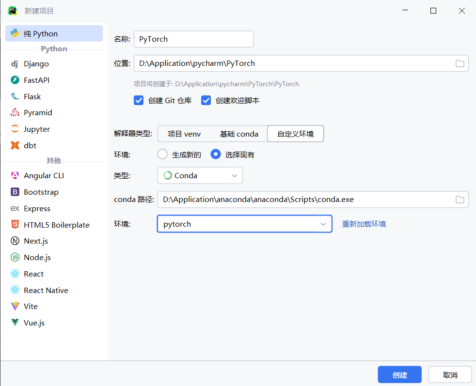
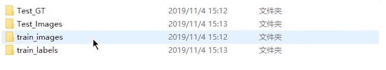

# JUN‘s PyTorch learning

## 1.环境配置

本文基于PyCharm 2024.1.4，pytorch-cuda 11.8，python 3.6.13，pytorch 1.10.2

### 1.1 Anaconda作用

#### 1. **包管理器**

Anaconda 内置了 `conda` 包管理器，能够轻松安装、更新、卸载和管理与数据科学相关的各种库和工具。`conda` 支持 Python 和其他语言（如 R）的包，解决了依赖关系问题，避免了包版本冲突。

#### 2. **虚拟环境管理**

通过 `conda`，Anaconda 提供了强大的虚拟环境管理功能。你可以**为不同的项目创建独立的环境**，这样每个项目可以拥有自己独立的包和依赖，**不会互相干扰**。这对于开发多个项目时尤其有用。

#### 3. **内置数据科学工具**

Anaconda 附带了大量常用的数据科学工具和库，例如：

- **NumPy**：用于数值计算的库
- **Pandas**：用于数据分析的库
- **Matplotlib** 和 **Seaborn**：用于数据可视化
- **SciPy**：科学计算
- **Scikit-learn**：机器学习
- **TensorFlow** 和 **PyTorch**：深度学习框架

#### 4. **Jupyter Notebook**

Anaconda 包含了 **Jupyter Notebook**，一个非常受欢迎的交互式编程环境，特别适合于数据分析、可视化以及机器学习实验。它支持通过网页界面实时执行代码，并且可以轻松分享和展示分析过程。

#### 5. **跨平台支持**

Anaconda 支持多种操作系统，包括 Windows、macOS 和 Linux，使得用户在不同平台上可以轻松地设置和使用数据科学工具。

#### 6. **Anaconda Navigator**

Anaconda 还提供了图形用户界面 **Anaconda Navigator**，帮助用户通过图形化的方式安装包、创建环境、启动 Jupyter Notebook 等工具，而不需要使用命令行。

### 1.2 `conda`常用指令

**`conda`**指令：

- 是一个通用的包管理器，除了管理 Python 包外，它还可以管理其他语言（如 R、C++、JavaScript）的包。`conda` 不仅管理 Python 代码，还管理与之相关的所有依赖和环境，如编译器、C++库、系统工具等。
- 使用 `conda install` 来安装包，通常 `conda` 环境中的包会优先从 Anaconda 官方仓库获取。

**`pip`**指令：

- 是专门用于管理 Python 包的工具，它只能安装 Python 包，并且依赖于 Python 的 `PyPI`（Python Package Index）仓库。
- 使用 `pip install` 安装包，它从 `PyPI` 仓库获取包。

**查看conda版本**

```bash
conda --version
```

**更新conda：**

```bash
conda update conda
```

**查看conda环境详细信息：**

```bash
conda info
```

**列出所有conda环境**

```bash
conda env list
```

**删除一个环境**

```bash
conda env remove --name envname
```

**使用`conda`指令创建新屋子：**

```bash
conda create -n pytorch python=3.6
```

`conda`是指调用`conda`包，`create`是创建的意思，`-n`是指后面的名字是屋子的名字，`pytorch`是屋子的名字 (可以更改成自己喜欢的)，`python=3.6`是指创建的屋子，是`python3.6`版本。

**激活新环境，即进入某个环境**

```bash
conda activate pytorch
```

**退出当前环境**

```bash
conda deactivate
```

**列出当前环境的所有包**

- 使用conda命令

  ```bash
  conda list
  ```

- 使用pip命令

  ```bash
  pip list
  ```

**安装一个包**

- 使用conda命令

  ```bash
  conda install package_name
  ```

- 使用pip命令

  ```bash
  pip install package_name
  ```

> 其中package_name是你想要安装的包名

**安装指定版本的包**

- 使用conda命令

  ```bash
  conda install package_name=x.x
  ```

- 使用pip命令

  ```bash
  pip install package_name==x.x
  ```

**更新一个包**

- 使用conda命令

  ```bash
  conda update package_name
  ```

- 使用pip命令

  ```bash
  pip install --upgrade package_name
  ```

**移除一个包**

- 使用conda命令

  ```bash
  conda remove package_name
  ```

- 使用pip命令

  ```bash
  pip uninstall package_name
  ```

**可检查当前环境下的Python版本：**

```bash
python --version
```

**查看pip的版本**

```bash
pip --version
```

**查看conda使用的源**

```bash
conda config --show channels
```

**切回默认源**

```bash
conda config --remove-key channels
```

**conda或pip清理包缓存**

- conda命令

  ```bash
  #使用 conda 的 clean 子命令来清除缓存包：
  conda clean --all
  #这将删除包缓存、索引缓存、未使用的包和 tarballs。
  #你也可以使用以下选项来精确控制清理内容：
  --packages 或 -p：#只清除包缓存
  --source-cache 或 -s：#只清除索引缓存
  --tarballs 或 -t：#只清除 tarballs
  --index-cache 或 -i：#只清除索引缓存，保证用的是镜像站提供的索引
  --locks：#删除所有的 conda 锁文件
  --tempfiles：#删除所有的 conda 临时文件
  ```

- pip命令

  ```bash
  pip cache purge
  ```

**分享/备份环境**

一个分享环境的快速方法就是给他一个你的环境的`.yml`文件。

首先激活到要分享的环境，在当前工作目录下生成一个`environment.yml`文件。

```bash
conda env export > environment.yml
```

对方拿到`environment.yml`文件后，将该文件放在工作目录下，可以通过以下命令从该文件创建环境。

```bash
conda env create -f environment.yml
```

### 1.3 pytorch的安装

打开官网

```web-idl
https://pytorch.org/
```

选择适配本机CPU和GPU的版本


将该命令输入到新构建的conda环境里面，等待下载

### 1.4 检验是否安装成功

pytorch环境窗口内输入

```bash
python
```

在打开的编译器里面输入(没报错就是pytorch安装成功)

```python
import torch
```

检测是否能使用GPU，继续输入

```python
torch.cuda.is_available()
```

显示true则说明本计算机的GPU是可以被pytorch使用的，false则相反

**退出python编译器：**

- 在 Python 解释器中输入以下命令并按回车：

  ```python
  exit()
  ```

- 使用 `quit()` 函数：

  ```python
  quit()
  ```

- **使用快捷键 `Ctrl + D`** （适用于 Linux 和 macOS）：

- **使用快捷键 `Ctrl + Z`，然后回车** （适用于 Windows）：

### 1.5 pycharm新建项目

这里选择自定义环境和选择现有，并类型是conda，Scripts目录内找到conda.exe

选择conda.exe后会自动加载已有的虚拟环境



打开python控制台进行验证

```python
import torch
torch.cuda.is_available()
```

显示true则说明本计算机的GPU是可以被pytorch使用的，false则相反

在pycharm里面可以将Jupyter Notebook安装到配置的新conda环境当中

以下是 Jupyter Notebook 和 PyCharm IDE 的对比表：

| 特性         | Jupyter Notebook                 | PyCharm IDE                        |
| ------------ | -------------------------------- | ---------------------------------- |
| **界面**     | 基于网页，支持交互式计算         | 桌面应用，功能全面                 |
| **交互性**   | 支持逐步执行代码块，实时查看输出 | 主要通过运行整个文件或单元进行调试 |
| **适用场景** | 数据科学、机器学习、可视化       | 软件开发、项目管理                 |
| **文档支持** | 支持 Markdown 和可视化           | 提供代码注释、文档字符串支持       |
| **调试功能** | 调试功能简单，主要依赖打印输出   | 提供强大调试工具（断点、变量查看） |
| **包管理**   | 依赖于命令行或其他工具安装包     | 内置包管理器，方便管理依赖         |
| **代码补全** | 基本支持                         | 智能代码补全与重构                 |
| **版本控制** | 需手动管理                       | 内置版本控制工具（如 Git）         |

1. **在新项目创建jupyter文件**

2. **提示需要安装jupyter软件包，进行安装**

3. **选择新建的conda解释器**

   

4. **代码检验是否安装成功**

   输入

   ```python
   import sys
   import torch
   print(torch.__version__)
   a=torch.tensor([[1,2,3],[4,5,6]])
   print(a)
   ```

   输出

   ```markdown
   1.10.2
   tensor([[1, 2, 3],
           [4, 5, 6]])
   ```

到目前为止基础环境已全部完成

## 2. PyTorch内容

pytorch 和 tensorflow 是目前主推的两个框架，他们的区别在于是**静态图优先（tensorflow）**还是**动态图优先（pytorch）**。

### 2.1 python两大工具

1. **`dir()`函数**：能让我们知道**工具箱(软件包)**以及工具箱中的分隔区有什么东西

   ```python
   dir(torch)//查看torch软件包里有什么
   dir(torch.AVG)//查看在torch软件包中的AVG里有什么
   ```

2. **`help()`函数：**能让我们知道每个工具是如何使用的，工具的使用方法

   ```
   help(torch)//查看torch软件包是如何使用的
   help(torch.cuda.is_available)//查看在torch软件包中的is_available是如何使用的
   ```

### 2.2 pytorch几个常用库的介绍

- `torch.utils.data` 中的 utils 表示的是 utilize，表示**常用的工具区**，后面的 .data 表示的是常用工具区中的 data 区。

- `PIL` 是指 Python Imaging Library，是一个用来打开、操作和保存许多不同格式图像文件的库。`PIL` 提供了许多图像处理的功能，如图像裁剪、旋转、颜色调整、滤镜等。

- `os` 是 "Operating System"（操作系统）的缩写。`os` 模块旨在提供一种与操作系统进行交互的便捷方式，因此采用了这个名称。通过 `os` 模块，Python 程序可以**与操作系统进行多种类型的交互**，执行文件操作、进程管理等任务。

### 2.3 PyTorch加载数据

在 PyTorch 中加载数据通常使用 `torch.utils.data` 模块，它提供了方便的数据加载和预处理功能。

1. **基本概念和步骤：**

   1. **Dataset类**

      - 提供一种方式去获取数据(即筛选出有用的数据)及其lable值(标签值)

      - 主要为了实现获得每一个数据及其label和统计出共有多少个数据
      - 自定义数据集通常通过**继承** `torch.utils.data.Dataset` 来创建，必须实现 `__len__()` 和 `__getitem__()` 方法

   2. **DataLoader类**

      - 主要将一批一批数据进行一个打包，为后面网络提供不同的数据形式

      - `DataLoader` 是 PyTorch 中的数据加载器，可以自动将数据分成批次、打乱数据顺序并支持多线程加载。

2. **常用数据集两种形式 ：**     

   1. 常用的第一种数据形式，文件夹的名称是它的label。      

      

      通过不同的文件夹将数据的标签和数据本身分开储存。

   2. 常用的第二种形式，lebel为文本格式，文本名称为图片名称，文本中的内容为对应的label。

   文件夹的名称即为 label，名称内是数据和编号。 

3. **数据加载：**

   1. **导入 Dataset 模块**

      ```python
      from torch.utils.data import Dataset  # 导入 Dataset 类
      ```

   2. **图片数据处理库—PIL**

      `PIL` 是指 Python Imaging Library，是一个用来打开、操作和保存许多不同格式图像文件的库。`PIL` 提供了许多图像处理的功能，如图像裁剪、旋转、颜色调整、滤镜等。

      下例为路径直接加载数据：

      ```python
      from PIL import Image
      
      # 打开图像
      image = Image.open("example.jpg")
      img_path = "D:\\path\\hymenoptera_data\\train\\ants\\0013035.jpg"  # 路径需要双斜杠表示转义
      image_2 = Image.open(img_path)
      
      # 显示图像
      image.show()
      ```

      在这个例子中，从 `PIL` 库中导入 `Image` 模块。`Image` 模块是 `PIL` 中最主要的模块，用于处理图像。而`Image.open("example.jpg")` 用于打开名为 `example.jpg` 的图像文件，然后 `image.show()` 用于显示这张图像。

      > **需要注意的是**，`PIL` 已经被 `Pillow` 所取代，`Pillow` 是 `PIL` 的一个分支，并且仍在积极维护和开发。

   3. **`os` 模块介绍**

      `os` 模块是 Python 的标准库模块之一，提供了许多与操作系统交互的功能。主要用于文件和目录操作、环境变量操作、进程管理等。以下是一些常用的功能：

      1. **文件和目录操作**：
         1. `os.getcwd()`：获取当前工作目录。
         2. `os.chdir(path)`：改变当前工作目录。
         3. `os.listdir(path)`：列出指定目录中的文件和子目录。
         4. `os.mkdir(path)`：创建目录。
         5. `os.makedirs(path)`：递归创建目录。
         6. `os.remove(path)`：删除文件。
         7. `os.rmdir(path)`：删除目录。
         8. `os.rename(src, dst)`：重命名文件或目录。
      2. **路径操作**：
         1. `os.path.basename(path)`：获取路径中的文件名部分。
         2. `os.path.dirname(path)`：获取路径中的目录部分。
         3. `os.path.join(path, *paths)`：将多个路径组合后返回。
         4. `os.path.split(path)`：将路径分割为目录和文件名。
         5. `os.path.exists(path)`：判断路径是否存在。
         6. `os.path.isabs(path)`：判断是否为绝对路径。
         7. `os.path.isfile(path)`：判断是否为文件。
         8. `os.path.isdir(path)`：判断是否为目录。
      3. **环境变量**：
         1. `os.getenv(key)`：获取环境变量的值。
         2. `os.putenv(key, value)`：设置环境变量的值。
         3. `os.environ`：获取所有环境变量的字典。
      4. **进程管理**：
         1. `os.system(command)`：运行系统命令。
         2. `os.popen(command)`：执行命令并获取输出。
         3. `os.getpid()`：获取当前进程 ID。
         4. `os.getppid()`：获取父进程 ID。

      > `os` 模块的强大功能使得 Python 在跨平台开发中具有很大的优势。

   4. **Dataset加载数据实例**

      ```python
      from torch.utils.data import Dataset  # 导入 Dataset 类
      from PIL import Image  # 引入图像处理库
      import os  # 导入操作系统接口库
      
      class MyData(Dataset):     
          def __init__(self, root_dir, label_dir):  # 初始化方法，创建实例时调用
              self.root_dir = root_dir  # 设置根目录，保存图像的主目录
              self.label_dir = label_dir  # 设置标签目录，存储特定类别的图像
              # 根据操作系统拼接路径
              self.path = os.path.join(self.root_dir, self.label_dir)  
              self.img_path = os.listdir(self.path)  # 获取标签目录下所有图片的文件名列表
              
          def __getitem__(self, idx):  # 根据索引获取数据
              img_name = self.img_path[idx]  # 获取当前索引对应的图片名称
              # 拼接得到完整的图片路径
              img_item_path = os.path.join(self.root_dir, self.label_dir, img_name)            
              img = Image.open(img_item_path)  # 打开图片
              label = self.label_dir  # 标签为当前类别
              return img, label  # 返回图像和对应标签
          
          def __len__(self):  # 返回数据集大小
              return len(self.img_path)  # 返回图片的数量
          
      # 设置根目录和类别目录
      root_dir = "Data/FirstTypeData/train"
      ants_label_dir = "ants"
      bees_label_dir = "bees"
      
      # 创建蚂蚁和蜜蜂的数据集
      ants_dataset = MyData(root_dir, ants_label_dir)  # 蚂蚁数据集
      bees_dataset = MyData(root_dir, bees_label_dir)  # 蜜蜂数据集
      
      # 打印每个数据集的大小
      print(len(ants_dataset))
      print(len(bees_dataset))
      
      # 合并两个数据集
      train_dataset = ants_dataset + bees_dataset  # train_dataset 是两个数据集的集合
      print(len(train_dataset))  # 打印合并后数据集的大小
      
      # 获取并显示第200个样本的标签和图像
      img, label = train_dataset[200]  # 获取索引为200的图像和标签
      print("label：", label)  # 打印标签
      img.show()  # 显示图像
      ```

      本代码示例展示了如何使用 PyTorch 创建自定义数据集类 `MyData`，该类继承自 `Dataset`。通过实现 `__init__`、`__getitem__` 和 `__len__` 方法，我们能够灵活地加载图像数据及其标签。在代码中，首先设置根目录和类别目录，然后创建不同类别的数据集实例，最后合并这两个数据集。通过索引访问，可以方便地获取特定样本的图像和标签并进行展示。


