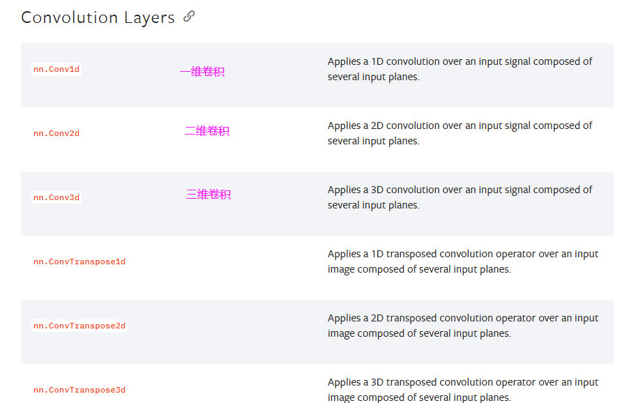

# JUN‘s PyTorch learning

## 1.环境配置

本文基于PyCharm 2024.1.4，pytorch-cuda 11.8，python 3.6.13，pytorch 1.10.2

### 1.1 Anaconda作用

#### 1. **包管理器**

Anaconda 内置了 `conda` 包管理器，能够轻松安装、更新、卸载和管理与数据科学相关的各种库和工具。`conda` 支持 Python 和其他语言（如 R）的包，解决了依赖关系问题，避免了包版本冲突。

#### 2. **虚拟环境管理**

通过 `conda`，Anaconda 提供了强大的虚拟环境管理功能。你可以**为不同的项目创建独立的环境**，这样每个项目可以拥有自己独立的包和依赖，**不会互相干扰**。这对于开发多个项目时尤其有用。

#### 3. **内置数据科学工具**

Anaconda 附带了大量常用的数据科学工具和库，例如：

- **NumPy**：用于数值计算的库
- **Pandas**：用于数据分析的库
- **Matplotlib** 和 **Seaborn**：用于数据可视化
- **SciPy**：科学计算
- **Scikit-learn**：机器学习
- **TensorFlow** 和 **PyTorch**：深度学习框架

#### 4. **Jupyter Notebook**

Anaconda 包含了 **Jupyter Notebook**，一个非常受欢迎的交互式编程环境，特别适合于数据分析、可视化以及机器学习实验。它支持通过网页界面实时执行代码，并且可以轻松分享和展示分析过程。

#### 5. **跨平台支持**

Anaconda 支持多种操作系统，包括 Windows、macOS 和 Linux，使得用户在不同平台上可以轻松地设置和使用数据科学工具。

#### 6. **Anaconda Navigator**

Anaconda 还提供了图形用户界面 **Anaconda Navigator**，帮助用户通过图形化的方式安装包、创建环境、启动 Jupyter Notebook 等工具，而不需要使用命令行。

### 1.2 `conda`常用指令

**`conda`**指令：

- 是一个通用的包管理器，除了管理 Python 包外，它还可以管理其他语言（如 R、C++、JavaScript）的包。`conda` 不仅管理 Python 代码，还管理与之相关的所有依赖和环境，如编译器、C++库、系统工具等。
- 使用 `conda install` 来安装包，通常 `conda` 环境中的包会优先从 Anaconda 官方仓库获取。

**`pip`**指令：

- 是专门用于管理 Python 包的工具，它只能安装 Python 包，并且依赖于 Python 的 `PyPI`（Python Package Index）仓库。
- 使用 `pip install` 安装包，它从 `PyPI` 仓库获取包。

**查看conda版本**

```bash
conda --version
```

**更新conda：**

```bash
conda update conda
```

**查看conda环境详细信息：**

```bash
conda info
```

**列出所有conda环境**

```bash
conda env list
```

**删除一个环境**

```bash
conda env remove --name envname
```

**使用`conda`指令创建新屋子：**

```bash
conda create -n pytorch python=3.6
```

`conda`是指调用`conda`包，`create`是创建的意思，`-n`是指后面的名字是屋子的名字，`pytorch`是屋子的名字 (可以更改成自己喜欢的)，`python=3.6`是指创建的屋子，是`python3.6`版本。

**激活新环境，即进入某个环境**

```bash
conda activate pytorch
```

**退出当前环境**

```bash
conda deactivate
```

**列出当前环境的所有包**

- 使用conda命令

  ```bash
  conda list
  ```

- 使用pip命令

  ```bash
  pip list
  ```

**安装一个包**

- 使用conda命令

  ```bash
  conda install package_name
  ```

- 使用pip命令

  ```bash
  pip install package_name
  ```

> 其中package_name是你想要安装的包名

**安装指定版本的包**

- 使用conda命令

  ```bash
  conda install package_name=x.x
  ```

- 使用pip命令

  ```bash
  pip install package_name==x.x
  ```

**更新一个包**

- 使用conda命令

  ```bash
  conda update package_name
  ```

- 使用pip命令

  ```bash
  pip install --upgrade package_name
  ```

**移除一个包**

- 使用conda命令

  ```bash
  conda remove package_name
  ```

- 使用pip命令

  ```bash
  pip uninstall package_name
  ```

**可检查当前环境下的Python版本：**

```bash
python --version
```

**查看pip的版本**

```bash
pip --version
```

**查看conda使用的源**

```bash
conda config --show channels
```

**切回默认源**

```bash
conda config --remove-key channels
```

**conda或pip清理包缓存**

- conda命令

  ```bash
  #使用 conda 的 clean 子命令来清除缓存包：
  conda clean --all
  #这将删除包缓存、索引缓存、未使用的包和 tarballs。
  #你也可以使用以下选项来精确控制清理内容：
  --packages 或 -p：#只清除包缓存
  --source-cache 或 -s：#只清除索引缓存
  --tarballs 或 -t：#只清除 tarballs
  --index-cache 或 -i：#只清除索引缓存，保证用的是镜像站提供的索引
  --locks：#删除所有的 conda 锁文件
  --tempfiles：#删除所有的 conda 临时文件
  ```

- pip命令

  ```bash
  pip cache purge
  ```

**分享/备份环境**

一个分享环境的快速方法就是给他一个你的环境的`.yml`文件。

首先激活到要分享的环境，在当前工作目录下生成一个`environment.yml`文件。

```bash
conda env export > environment.yml
```

对方拿到`environment.yml`文件后，将该文件放在工作目录下，可以通过以下命令从该文件创建环境。

```bash
conda env create -f environment.yml
```

### 1.3 pytorch的安装

打开官网

```web-idl
https://pytorch.org/
```

选择适配本机CPU和GPU的版本


将该命令输入到新构建的conda环境里面，等待下载

### 1.4 检验是否安装成功

pytorch环境窗口内输入

```bash
python
```

在打开的编译器里面输入(没报错就是pytorch安装成功)

```python
import torch
```

检测是否能使用GPU，继续输入

```python
torch.cuda.is_available()
```

显示true则说明本计算机的GPU是可以被pytorch使用的，false则相反

**退出python编译器：**

- 在 Python 解释器中输入以下命令并按回车：

  ```python
  exit()
  ```

- 使用 `quit()` 函数：

  ```python
  quit()
  ```

- **使用快捷键 `Ctrl + D`** （适用于 Linux 和 macOS）：

- **使用快捷键 `Ctrl + Z`，然后回车** （适用于 Windows）：

### 1.5 pycharm新建项目

这里选择自定义环境和选择现有，并类型是conda，Scripts目录内找到conda.exe

选择conda.exe后会自动加载已有的虚拟环境


打开python控制台进行验证

```python
import torch
torch.cuda.is_available()
```

显示true则说明本计算机的GPU是可以被pytorch使用的，false则相反

在pycharm里面可以将Jupyter Notebook安装到配置的新conda环境当中

以下是 Jupyter Notebook 和 PyCharm IDE 的对比表：

| 特性         | Jupyter Notebook                 | PyCharm IDE                        |
| ------------ | -------------------------------- | ---------------------------------- |
| **界面**     | 基于网页，支持交互式计算         | 桌面应用，功能全面                 |
| **交互性**   | 支持逐步执行代码块，实时查看输出 | 主要通过运行整个文件或单元进行调试 |
| **适用场景** | 数据科学、机器学习、可视化       | 软件开发、项目管理                 |
| **文档支持** | 支持 Markdown 和可视化           | 提供代码注释、文档字符串支持       |
| **调试功能** | 调试功能简单，主要依赖打印输出   | 提供强大调试工具（断点、变量查看） |
| **包管理**   | 依赖于命令行或其他工具安装包     | 内置包管理器，方便管理依赖         |
| **代码补全** | 基本支持                         | 智能代码补全与重构                 |
| **版本控制** | 需手动管理                       | 内置版本控制工具（如 Git）         |

1. **在新项目创建jupyter文件**

2. **提示需要安装jupyter软件包，进行安装**

3. **选择新建的conda解释器**

   

4. **代码检验是否安装成功**

   输入

   ```python
   import sys
   import torch
   print(torch.__version__)
   a=torch.tensor([[1,2,3],[4,5,6]])
   print(a)
   ```

   输出

   ```markdown
   1.10.2
   tensor([[1, 2, 3],
           [4, 5, 6]])
   ```

到目前为止基础环境已全部完成

## 2. PyTorch基础内容

pytorch 和 tensorflow 是目前主推的两个框架，他们的区别在于是**静态图优先（tensorflow）**还是**动态图优先（pytorch）**。

### 2.1 python两大工具

1. **`dir()`函数**：能让我们知道**工具箱(软件包)**以及工具箱中的分隔区有什么东西

   ```python
   dir(torch)//查看torch软件包里有什么
   dir(torch.AVG)//查看在torch软件包中的AVG里有什么
   ```

2. **`help()`函数：**能让我们知道每个工具是如何使用的，工具的使用方法

   ```
   help(torch)//查看torch软件包是如何使用的
   help(torch.cuda.is_available)//查看在torch软件包中的is_available是如何使用的
   ```

### 2.2 pytorch几个常用库的介绍

- `torch.utils.data` 中的 utils 表示的是 utilize，表示**常用的工具区**，后面的 .data 表示的是常用工具区中的 data 区。

- `PIL` 是指 Python Imaging Library，是一个用来打开、操作和保存许多不同格式图像文件的库。`PIL` 提供了许多图像处理的功能，如图像裁剪、旋转、颜色调整、滤镜等。

- `os` 是 "Operating System"（操作系统）的缩写。`os` 模块旨在提供一种与操作系统进行交互的便捷方式，因此采用了这个名称。通过 `os` 模块，Python 程序可以**与操作系统进行多种类型的交互**，执行文件操作、进程管理等任务。

### 2.3 PyTorch加载数据

在 PyTorch 中加载数据通常使用 `torch.utils.data` 模块，它提供了方便的数据加载和预处理功能。

#### **2.3.1 基本概念和步骤**

1. **Dataset类**

   - 提供一种方式去获取数据(即筛选出有用的数据)及其lable值(标签值)

   - 主要为了实现获得每一个数据及其label和统计出共有多少个数据
   - 自定义数据集通常通过**继承** `torch.utils.data.Dataset` 来创建，必须实现 `__len__()` 和 `__getitem__()` 方法

2. **DataLoader类**

   - 主要将一批一批数据进行一个打包，为后面网络提供不同的数据形式

   - `DataLoader` 是 PyTorch 中的数据加载器，可以自动将数据分成批次、打乱数据顺序并支持多线程加载。

   - 打包（batch_size），为后面的神经网络提供不同的数据形式

3. **常用数据集两种形式 ：**     

   1. 常用的第一种数据形式，文件夹的名称是它的label。      

      

      通过不同的文件夹将数据的标签和数据本身分开储存。

   2. 常用的第二种形式，lebel为文本格式，文本名称为图片名称，文本中的内容为对应的label。

   

   > 文件夹的名称即为 label，名称内是数据和编号。 

#### **2.3.2 数据加载**

1. **导入 Dataset 模块**

   ```python
   from torch.utils.data import Dataset  # 导入 Dataset 类
   ```

2. **图片读取**

   - **图片数据处理库—PIL**

     `PIL` 是指 Python Imaging Library，是一个用来打开、操作和保存许多不同格式图像文件的库。`PIL` 提供了许多图像处理的功能，如图像裁剪、旋转、颜色调整、滤镜等。

     下例为路径直接加载数据：

     ```python
     from PIL import Image
     
     # 打开图像
     image = Image.open("example.jpg")
     img_path = "D:\\path\\hymenoptera_data\\train\\ants\\0013035.jpg"  # 路径需要双斜杠表示转义
     image_2 = Image.open(img_path)
     
     # 显示图像
     image.show()
     ```

     在这个例子中，从 `PIL` 库中导入 `Image` 模块。`Image` 模块是 `PIL` 中最主要的模块，用于处理图像。而`Image.open("example.jpg")` 用于打开名为 `example.jpg` 的图像文件，然后 `image.show()` 用于显示这张图像。

     > **需要注意的是**，`PIL` 已经被 `Pillow` 所取代，`Pillow` 是 `PIL` 的一个分支，并且仍在积极维护和开发。

   - 利用`opencv`读取图片，获得`numpy`型图片数据

     **安装opencv：** 

     在 PyCharm的 Terminal 里输入

     ```bash
     conda install opencv-python
     ```

     再

     ```python
     import cv2
     ```

3. **`os` 模块介绍**

   `os` 模块是 Python 的标准库模块之一，提供了许多与操作系统交互的功能。主要用于文件和目录操作、环境变量操作、进程管理等。以下是一些常用的功能：

   1. **文件和目录操作**：
      1. `os.getcwd()`：获取当前工作目录。
      2. `os.chdir(path)`：改变当前工作目录。
      3. `os.listdir(path)`：列出指定目录中的文件和子目录。
      4. `os.mkdir(path)`：创建目录。
      5. `os.makedirs(path)`：递归创建目录。
      6. `os.remove(path)`：删除文件。
      7. `os.rmdir(path)`：删除目录。
      8. `os.rename(src, dst)`：重命名文件或目录。
   2. **路径操作**：
      1. `os.path.basename(path)`：获取路径中的文件名部分。
      2. `os.path.dirname(path)`：获取路径中的目录部分。
      3. `os.path.join(path, *paths)`：将多个路径组合后返回。
      4. `os.path.split(path)`：将路径分割为目录和文件名。
      5. `os.path.exists(path)`：判断路径是否存在。
      6. `os.path.isabs(path)`：判断是否为绝对路径。
      7. `os.path.isfile(path)`：判断是否为文件。
      8. `os.path.isdir(path)`：判断是否为目录。
   3. **环境变量**：
      1. `os.getenv(key)`：获取环境变量的值。
      2. `os.putenv(key, value)`：设置环境变量的值。
      3. `os.environ`：获取所有环境变量的字典。
   4. **进程管理**：
      1. `os.system(command)`：运行系统命令。
      2. `os.popen(command)`：执行命令并获取输出。
      3. `os.getpid()`：获取当前进程 ID。
      4. `os.getppid()`：获取父进程 ID。

   > `os` 模块的强大功能使得 Python 在跨平台开发中具有很大的优势。

4. **`__getitem__`方法**

   - `Dataset` 是一个抽象类，所有数据集都需要继承这个类，所有子类都需要重写 `__getitem__` 的方法，这个方法主要是获取每个数据集及其对应 `label`

   - 通过实现这个方法，可以使自定义对象**像列表或字典**一样支持**索引访问**

   ```python
   class MyList:
       def __init__(self, initial_data):
           self.data = initial_data
   
       def __getitem__(self, index):
           return self.data[index]
   
   # 使用自定义类
   my_list = MyList([1, 2, 3, 4, 5])
   
   print(my_list[0])  # 输出: 1
   print(my_list[2])  # 输出: 3
   
   ```

   在这个示例中，`MyList` 类实现了 `__getitem__` 方法，使得可以通过索引访问 `data` 列表的元素

   > `__getitem__` 方法会在你使用索引访问对象时自动调用，可理解为对象变成列表了

5. **重写长度类 `__len__`**

   重写 `__len__` 方法可以让你的自定义类支持 `len()` 函数，从而返回对象的长度或大小

   ```python
   class MyCollection:
       def __init__(self, items):
           self.items = items
   
       def __len__(self):
           return len(self.items)
   
   # 使用自定义类
   collection = MyCollection([1, 2, 3, 4, 5])
   
   print(len(collection))  # 输出: 5
   
   ```

6. **路径**

   

   > 对于绝对路径引号前加 r 可以防止转义，或使用双斜杠 

   ```python
   from PIL import Image
   
   img_path = r"E:\\PyTorch\\0013035.jpg"
   #img_path = "E:\\PyTorch\\0013035.jpg"
   
   img = Image.open(img_path)
   ```

   > 在Python控制台运行代码，可以看到所有变量的值和属性
   >
   > 可借助Python控制台实现debug观测数据功能

7. **数据集间相加**

   - `Dataset` 内置了 `__add__`时

     数据集的合并通过 `+` 操作符来实现的，实际上是在调用对象的 `__add__` 方法。对于内置类型（如列表），这会将两个列表合并

     内置方法 `__add__` 

     ```python
     def __add__(self, other: 'Dataset[T_co]') -> 'ConcatDataset[T_co]':
     	return ConcatDataset([self, other])
     ```

     所以可以直接通过 `+` 操作符实现

     ```python
     from torch.utils.data import Dataset  # 导入 Dataset 类
     
     # 合并两个数据集
     train_dataset = ants_dataset + bees_dataset  # train_dataset 是两个数据集的集合
     print(len(train_dataset))  # 打印合并后数据集的大小
     ```

   - `Dataset` 没有内置 `__add__`时

     使用 PyTorch 的 `ConcatDataset`

     ```python
     from torch.utils.data import ConcatDataset	# 导入 ConcatDataset 类
     
     train_dataset = ConcatDataset([ants_dataset, bees_dataset])
     print(len(train_dataset))  # 打印合并后数据集的大小
     ```

#### **2.3.3  Dataset加载数据实例**

1. **数据格式1**

   **采用文件夹命名的数据：**

   ```python
   from torch.utils.data import Dataset  # 导入 Dataset 类
   from PIL import Image  # 引入图像处理库
   import os  # 导入操作系统接口库
   
   class MyData(Dataset):     
       def __init__(self, root_dir, label_dir):  # 初始化方法，创建实例时调用
           self.root_dir = root_dir  # 设置根目录，保存图像的主目录
           self.label_dir = label_dir  # 设置标签目录，存储特定类别的图像
           # 根据操作系统拼接路径
           self.path = os.path.join(self.root_dir, self.label_dir)  
           self.img_path = os.listdir(self.path)  # 将文件夹下的东西变成一个列表
           
       def __getitem__(self, idx):  # 根据索引获取数据,idx为编号
           img_name = self.img_path[idx]  # 获取当前索引对应的图片名称
           # 拼接得到完整的图片路径
           img_item_path = os.path.join(self.root_dir, self.label_dir, img_name)            
           img = Image.open(img_item_path)  # 打开图片
           label = self.label_dir  # 标签为当前类别
           return img, label  # 返回图像和对应标签
       
       # 重写长度类 __len__
       def __len__(self):  # 返回数据集大小
           return len(self.img_path)  # 返回图片的数量
       
   # 设置根目录和类别目录
   root_dir = "Data/hymenoptera_data/train"
   ants_label_dir = "ants"
   bees_label_dir = "bees"
   
   # 创建蚂蚁和蜜蜂的数据集
   ants_dataset = MyData(root_dir, ants_label_dir)  # 蚂蚁数据集
   bees_dataset = MyData(root_dir, bees_label_dir)  # 蜜蜂数据集
   
   # 打印每个数据集的大小
   print(len(ants_dataset))
   print(len(bees_dataset))
   
   # 合并两个数据集
   train_dataset = ants_dataset + bees_dataset  # train_dataset 是两个数据集的集合
   print(len(train_dataset))  # 打印合并后数据集的大小
   
   # 获取并显示第200个样本的标签和图像
   img, label = train_dataset[200]  # 获取索引为200的图像和标签
   print("label：", label)  # 打印标签
   img.show()  # 显示图像
   ```

   本代码示例展示了如何使用 PyTorch 创建自定义数据集类 `MyData`，该类继承自 `Dataset`。通过实现 `__init__`、`__getitem__` 和 `__len__` 方法，我们能够灵活地加载图像数据及其标签。在代码中，首先设置根目录和类别目录，然后创建不同类别的数据集实例，最后合并这两个数据集。通过索引访问，可以方便地获取特定样本的图像和标签并进行展示。

2. **数据格式2**

   > 如果标签不仅仅是简单的单词（如 `ants` 或 `bees`），而是更复杂的结构，比如多个属性、位置信息、类别编号、目标检测的边界框、关键点等，用**文件夹命名**的方式**无法容纳或管理**这些复杂的标签信息。

   将每张图片对应一个 `.txt` 文件，可以更灵活地存储标签数据。可以在 `.txt` 文件中存储任意格式的标签信息（如 JSON、CSV、甚至是多行文本），这比文件夹命名的方式更加灵活。

   例如，假设一张图片有多个目标，每个目标有不同的属性（类别、位置等），可以在 `.txt` 文件中组织类似这样的标签：

   ```python
   {"class": "cat", "bbox": [50, 30, 200, 180]}
   {"class": "dog", "bbox": [150, 120, 300, 250]}
   ```

   即**每张图片对应一个txt文件，txt里存储label信息**的方式

   

   **rename_dataset.py**

   ```python
   import os 
   
   # 设置原始图像数据的根目录
   root_dir = r"E:\train"
   
   # 定义目标目录名，将原来的“ants”重命名为“ants_image”
   target_dir = "ants_image"
   
   # 获取目标目录下所有文件的列表
   img_path = os.listdir(os.path.join(root_dir, target_dir))
   
   # 从目标目录名中提取标签，这里提取的是“ants”，字符串切割
   label = target_dir.split('_')[0]  # ants
   
   # 定义输出目录，用于保存生成的标签文件
   out_dir = "ants_label"
   
   # 遍历目标目录中的每个图像文件
   for i in img_path:
       # 提取文件名（不包括扩展名）
       file_name = i.split('.jpg')[0]
       
       # 创建输出文件的完整路径
       output_file_path = os.path.join(root_dir, out_dir, "{}.txt".format(file_name))
       
       # 打开（或创建）输出文件，模式为'w'（写入），若文件已存在则覆盖
       with open(output_file_path, 'w') as f:
           # 将标签写入到对应的文本文件中
           f.write(label)
   ```

   > - `split('_')` 返回的是一个列表，`[0]` 是索引操作，它表示获取列表的第一个元素
   >
   > - `"{}.txt"` 是一个带有占位符 `{}` 的字符串，`{}` 是用于插入值的位置。
   >
   >   `format(file_name)` 会将 `file_name` 的值插入到 `{}` 处，生成新的字符串。
   >
   > -  `with open as f`语法操作文件(打开文件执行完函数体后会自动关闭该文件)

### 2.4 TensorBoard的使用

> **TensorBoard** 是一个可视化工具，主要用于跟踪和分析机器学习模型的训练过程

它是 `TensorFlow` 生态系统的一部分，但也可以用于 `PyTorch` 等其他框架，通过它可以**直观地**查看模型的**训练进展、性能指标、计算图、分布直方图**等。

#### 2.4.1 安装TensorBoard

在 PyCharm的 Terminal 里输入

```bash
conda install tensorboard
```

#### 2.4.2 SummaryWriter类

`SummaryWriter` 是 PyTorch 中的一个类，用于在**训练深度学习模型**的过程中**记录各种数据**（如损失值、精度、图像、计算图等），并将这些数据保存到指定的目录。随后，可以使用 TensorBoard 可视化这些数据。

**导入 `SummaryWriter`**：

```python
from torch.utils.tensorboard import SummaryWriter
```

> 查看一个类如何使用：在PyCharm中，按住Ctrl键，把鼠标移到类上

这是一个直接向 log_dir 文件夹写入的事件文件，可以被 TensorBoard 进行解析

**初始化函数：**

```python
def __init__(self, log_dir=None):
```


**实例化SummaryWriter类：**

```python
writer = SummaryWriter("logs")   # 把对应的事件文件存储到logs文件夹下
```

#### 2.4.3  add_scalar() 方法的使用

 `add_scalar()` ：

- 记录标量（例如损失值、精度等）
- 每次调用时，可以为标量数据指定一个名称，并传递对应的数值和迭代的步数。
- 可以将这些标量数据写入日志文件，并在 TensorBoard 中进行可视化

##### **1. 函数内容**

```python
def add_scalar(
        self,
        tag,
        scalar_value,
        global_step=None,
        walltime=None,
        new_style=False,
        double_precision=False,
    ):
```

添加一个标量数据到 Summary 当中，一般需要参数

- **tag：**Data指定方式，类似于图表的title
- **scalar_value：**需要保存的数值（y轴）
- **global_step：**训练到多少步（x轴）

##### **2. 示例**

**y=x**

```python
from torch.utils.tensorboard import SummaryWriter   #导入SummaryWriter类

#创建实例
writer=SummaryWriter("logs")   #把对应的事件文件存储到logs文件夹下

# y=x
for i in range(100):
    writer.add_scalar("y=x",i,i)
writer.close()
```

##### **3. 运行后报错**


**需要调整安装`conda`硬盘的虚拟内存**


调整重启后成功运行多了一个`logs`文件夹，下面是TensorBoard的一些事件文件，如图：


##### **5. 打开事件文件**

在 Terminal 里输入：

```python
tensorboard --logdir=logs  # logdir=事件文件所在文件夹名
```

**结果如图：**


**打开网页：**


##### 6. 防止和别人冲突

（一台服务器上有好几个人训练，默认打开的都是6006端口），也可以指定端口，命令如下：

```python
tensorboard --logdir=logs --port=6007
```

##### 7. 清除上一个事件

每向 writer 中写入新的事件，也记录了上一个事件

若不清除，图像过程中会发生拟合


所以需要清除上一个写入的事件

把**logs**文件夹下的**所有文件删掉**，**程序删掉，重新开始**

或：重新写一个子文件，即创建新的 `SummaryWriter("新文件夹")`

> 删掉logs下的文件，重新运行代码，在 Terminal 里按 Ctrl+C ，再输入命令：
>
> tensorboard --logdir=logs --port=6007

#### 2.4.4 add_image() 的使用

`add_image()`： 

是 PyTorch 的 `SummaryWriter` 类中的方法，允许将图像数据记录到 TensorBoard 中

用于可视化模型的输入、输出或中间结果。这在处理图像数据的任务（如计算机视觉）中特别有用。

##### 1. 函数内容

```python
def add_image(
    self, 
    tag, 
    img_tensor, 
    global_step=None, 
    walltime=None, 
    dataformats='CHW'):
```

**参数说明**

- **tag**：对应图像的title

- **img_tensor：图像的数据类型，只能是torch.Tensor、numpy.array、string/blobname**

- **global_step**：

  训练步骤，`int` 类型，通常用于跟踪当前是哪个 epoch 或 batch。

  如果没有指定，`global_step` 的默认值是 **`None`**

- **walltime**：`float` 类型，可选，表示时间戳，用来指定记录的时间，一般情况下不用特别指定。

- **dataformats**：`str` 类型，指定图像数据的格式。常见的格式有：

  - `CHW`（默认）：表示图像张量的形状是 `(channels, height, width)`。
  - `HWC`：表示图像张量的形状是 `(height, width, channels)`，常用于 OpenCV 或 PIL 读取的图像。
  - `HW`：表示灰度图像的形状是 `(height, width)`。


由下例子得知对于`OpenCV` 或 `PIL` 读取的图像所传入的`img_tensor`参数需要为`numpy`类型


##### 2. `numpy`类型

`numpy` 是一个广泛使用的 Python 库，用于进行高效的数值计算和数据处理。

它提供了支持多维数组和矩阵运算的功能，以及许多数学函数，用于对这些数组进行操作

> `numpy` 的核心数据结构是 `ndarray`，即 **n 维数组**。它支持多维数组操作，能够高效存储和处理大量数据。

- 使用 `numpy` 提供的函数可以方便地创建数组
- `numpy` 支持各种数组操作，包括索引、切片、拼接、形状改变等
- `numpy` 提供了大量的数学函数，如加减乘除、三角函数、统计函数等

示例：

```python
import numpy as np

# 创建数组
array = np.array([[1, 2, 3], [4, 5, 6]])

# 访问元素
print("元素 [1, 2]:", array[1, 2])  # 访问第二行第三列的元素

# 数组运算
array_squared = array ** 2  # 每个元素平方
print("平方后的数组:\n", array_squared)

# 计算和
total_sum = np.sum(array)
print("数组元素的总和:", total_sum)

# 计算均值
mean_value = np.mean(array)
print("数组的均值:", mean_value)
```

##### 3. 对图片进行转换

利用`numpy.array()`，对`PIL`图片进行转换

在Python控制台，把**`PIL`类型的img变量**转换为**`numpy`类型（`add_image()` 函数所需要的图像的数据类型）**，重新赋值给`img_array`：

```python
import numpy as np
from PIL import Image

image_path = "Data/hymenoptera_data/train/ants_image/0013035.jpg"
img = Image.open(image_path)

img_array=np.array(img)
print(type(img_array))   # numpy.ndarray
```

##### 4. `shape` 属性

`shape` 是一个属性，用于表示数组的维度和每个维度的大小。它返回一个元组，包含每个维度的大小，帮助用户了解数组的结构

**从`PIL`到`numpy`，需要在`add_image()`中指定`shape`中每一个数字/维表示的含义**

即修改`dataformats`的值为`dataformats='HWC'`

##### 5. **蚂蚁为例**

```python
from torch.utils.tensorboard import SummaryWriter   #导入SummaryWriter类
import numpy as np
from PIL import Image
 
#创建实例
writer=SummaryWriter("logs")   #把对应的事件文件存储到logs文件夹下
image_path="Data/hymenoptera_data/train/ants_image/0013035.jpg"
img_PIL=Image.open(image_path)
img_array=np.array(img_PIL)
print(type(img_array))
print(img_array.shape)   #(512,768,3)  即(H,W,C)(高度，宽度，通道)
 
writer.add_image("test",img_array,1, dataformats='HWC')  # 第1步
 
writer.close()
```


##### 6. **蜜蜂为例**

```python
from torch.utils.tensorboard import SummaryWriter   #导入SummaryWriter类
import numpy as np
from PIL import Image
 
#创建实例
writer=SummaryWriter("logs")   #把对应的事件文件存储到logs文件夹下
image_path="Data/hymenoptera_data/train/bees_image/16838648_415acd9e3f.jpg"
img_PIL=Image.open(image_path)
img_array=np.array(img_PIL)
print(type(img_array))
print(img_array.shape)   #(512,768,3)  即(H,W,C)(高度，宽度，通道)
 
writer.add_image("test",img_array,2, dataformats='HWC')   # 第2步
 
writer.close()
```

由于`tag`没有变，所以第二个蜜蜂例子也在同一图像当中，并且将`global_step`设置为2，可将蜜蜂图片设置到第二次训练步骤当中，如图：


> 在一个title下，**通过滑块显示每一步的图形**，可以直观地观察训练中给model提供了哪些数据，或者想对model进行测试时，可以看到每个阶段的输出结果
>
> 如果想要**单独显示**，重命名一下title即可，即 writer.add_image() 的第一个字符串类型的参数

## 3. transforms的使用

> `transforms` 是 `torchvision` 库中的一个模块，主要用于对图像数据进行各种预处理和增强操作

### 3.1 transforms的基本语法

```python
from torchvision import transforms
```

#### 3.1.1 常用的 Transforms类

1. **基本转换**：
   - `ToTensor`：把一个PIL的Image或者numpy数据类型的图片转换成 tensor 的数据类型，将图像转换为 PyTorch 张量，并将像素值缩放到 [0, 1] 范围
   - `ToPILImage`：把一个图片转换成PIL Image
   - `Normalize`：对图像进行归一化，通常使用预定义的均值和标准差。
   - `Resize`：调整图像的大小。
   - `CenterCrop`：中心裁剪
2. **数据增强**：
   - `RandomHorizontalFlip`：以一定概率水平翻转图像。
   - `RandomRotation`：随机旋转图像。
   - `ColorJitter`：随机调整图像的亮度、对比度、饱和度和色调。
3. **组合变换**：
   - `Compose`：将多个变换组合在一起，以便一次性应用。

> 拿一些**特定格式**的图片，经过Transforms工具后，就会输出我们想要的图片变换的结果

### 3.2 transforms 使用过程

从transforms中选择一个class，对它进行创建，对创建的对象传入图片，即可返回出结果 

如`ToTensor`将一个 `PIL Image` 或 `numpy.ndarray` 转换为 `tensor`的数据类型 


```python
from PIL import Image
from torchvision import transforms

img_path="Data/hymenoptera_data/train/ants_image/0013035.jpg" 
img = Image.open(img_path)   #Image是Python中内置的图片的库
print(img)  # PIL类型

# 1、Transforms该如何使用
tensor_trans = transforms.ToTensor()  #从工具箱transforms里取出ToTensor类，返回tensor_trans对象
tensor_img=tensor_trans(img)   #创建出tensor_trans后，传入其需要的参数，即可返回结果
print(tensor_img)
```

### 3.3 Tensor 数据类型

- `Tensor` 数据类型包装了反向神经网络所需要的一些理论基础的参数，如：`_backward_hooks`、`_grad`等（先转换成`Tensor`数据类型，再训练）
- Tensors 支持在 GPU 上进行计算，极大提高了运算速度。这对于深度学习模型的训练和推理至关重要。

> 几乎所有现代深度学习框架（如 PyTorch、TensorFlow、JAX）都使用 Tensors 作为**基本数据类型**
>
> 可以理解为`Tensors`包装了神经网络所需要的一些参数

### 3.4  读取图片的方式

图片有不同的格式，打开方式也不同

| **图片格式** | **打开方式**                             |
| ------------ | ---------------------------------------- |
| PIL          | Image.open()  ——Python自带的图片打开方式 |
| tensor       | ToTensor()                               |
| narrays      | cv.imread()  ——Opencv                    |

#### **3.4.1 PIL Image**

```python
from PIL import Image

img_path = "xxx"
img = Image.open(img_path)

img.show()
```

#### **3.4.2 numpy.ndarray**

通过opencv

```python
import cv2
cv_img=cv2.imread(img_path)
```

#### 3.4.3 使用torch.Tensor 类型

> **img_tensor：图像的数据类型，只能是torch.Tensor、numpy.array、string/blobname**

除了上一章使用`numpy.array`类型之外，还可使用`torch.Tensor`类型

把 `PIL Image` 或 `numpy.ndarray` 类型转换为 `tensor` 类型（`TensorBoard` 必须是 `tensor` 的数据类型）

```python
from PIL import Image
from torch.utils.tensorboard import SummaryWriter
from torchvision import transforms
 
img_path="Data/hymenoptera_data/train/ants_image/0013035.jpg"
img = Image.open(img_path)   #Image是Python中内置的图片的库
print(img)					# 可以看到类型是PIL
writer = SummaryWriter("logs")

# Transforms使用
tensor_trans = transforms.ToTensor()  #从工具箱transforms里取出ToTensor类，返回tensor_trans对象
tensor_img = tensor_trans(img)   #创建出tensor_trans后，传入其需要的参数，即可返回结果
print(tensor_img)

writer.add_image("Tensor_img",tensor_img)  # .add_image(tag, img_tensor, global_step)
# tag即名称
# img_tensor的类型为torch.Tensor/numpy.array/string/blobname
# global_step为int类型

writer.close()
```

### 3.5 常见的Transforms的使用

#### 3.5.1 Python中 `__call__` 用法

内置函数 `__call__` ，**不用.的方式调用方法，可以直接拿对象名，加上需要的参数，即可调用方法**

> 按 Ctrl+p，会提示括号里面需要什么参数

```python
class Person:

    def __call__(self, name):   #下划线__表示为内置函数
        print("__call__"+"Hello "+name)

    def hello(self,name):
        print("hello"+name)

person = Person()
person("zhangsan")  # 此处调用到了__call__
person.hello("lisi")
```

输出结果如下：

```markdown
__call__Hello zhangsan
hellolisi
```

#### 3.5.2 ToPILImage 的使用

把 `tensor` 数据类型或 `ndarray` 类型转换成 `PIL Image`

#### 3.5.3 Normalize 的使用

用**平均值/标准差归一化** `tensor` 类型的 `image`（输入）

> 标准化通常是深度学习中的重要步骤
>
> 目的是将输入数据的均值调整为 0，方差调整为 1，从而加速收敛和提高模型性能

`Normalize` 接受三个主要参数：

1. **mean**：一个包含每个通道**均值**的列表或元组。
2. **std**：一个包含每个通道**标准差**的列表或元组。
3. **inplace**：可选，布尔值，指示是否在**原地进行标准化**（默认为 `False`）。

图片RGB三个信道，将每个信道中的输入进行**归一化**

> `output[channel] = (input[channel] - mean[channel]) / std[channel]`

由上式可得，为了使得每个信道输入**归一化**，需设置 `mean` 和 `std` 都为0.5，则 `output= 2*input -1`

如果 `input` 图片像素值为**0~1**范围内，那么结果就是 **-1~1**之间

```python
from PIL import Image
from torch.utils.tensorboard import SummaryWriter
from torchvision import transforms

writer = SummaryWriter("logs")
img = Image.open("Data/hymenoptera_data/train/ants_image/0013035.jpg")
print(img)  # 可以看到类型是PIL

# ToTensor的使用
trans_totensor = transforms.ToTensor()  # 将类型转换为tensor
img_tensor = trans_totensor(img)  # img变为tensor类型后，就可以放入TensorBoard当中

# Normalize的使用
print(img_tensor[0][0][0])  # 第0层第0行第0列

# mean,std，因为图片是RGB三信道，故传入三个数
trans_norm = transforms.Normalize(mean=[0.5, 0.5, 0.5], std=[0.5, 0.5, 0.5])

img_norm = trans_norm(img_tensor)  # 输入的类型要是tensor
print(img_norm[0][0][0])
writer.add_image("Normalize", img_norm, 1)
writer.close()

```

**结果如图：**


#### 3.5.4 Resize的使用

**输入：**`PIL Image`

用于**调整图像的大小**

`Resize` 接受以下参数：

1. **size**：一个整数或一个元组。**若为整数**，图像的**较短边**将被调整为该值，**保持图像的纵横比**；若为元组，指定图像的**目标宽度和高度**。
2. **interpolation**：插值方法，可选，默认是 `PIL.Image.BILINEAR`。可选的插值方法有 `PIL.Image.NEAREST`、`PIL.Image.BOX`、`PIL.Image.BILINEAR`、`PIL.Image.HAMMING`、`PIL.Image.BICUBIC` 和 `PIL.Image.LANCZOS`。

- **一个整数：**不改变高和宽的比例，只单纯改变最小边和最长边之间的大小关系。之前图里最小的边将会匹配这个数（等比缩放）
- **返回值还是 `PIL Image`**`img：PIL --> resize --> img_resize：PIL`

```python
from PIL import Image
from torch.utils.tensorboard import SummaryWriter
from torchvision import transforms

writer = SummaryWriter("logs")
img = Image.open("Data/hymenoptera_data/train/ants_image/0013035.jpg")
print(img.size)  # 输入是PIL.Image

# ToTensor的使用
trans_totensor = transforms.ToTensor()  # 将类型转换为tensor
#Resize的使用
trans_resize = transforms.Resize((512,512))

#img：PIL --> resize --> img_resize：PIL
img_resize = trans_resize(img)  #输出还是PIL Image

#img_resize：PIL --> totensor --> img_resize：tensor（同名，覆盖）
img_resize = trans_totensor(img_resize)

writer.add_image("Resize",img_resize,0)
print(img_resize)
writer.close()
```

**结果如图：**


#### 3.5.5 Compose 的使用

用于将多个**图像变换组合在一起**，以便在数据预处理过程中**一次性应用**，对于构建数据处理流水线非常方便

**例子：**

```python
Example:图片首先要经过中心裁剪，再转换成Tensor数据类型
        >>> transforms.Compose([
        >>>     transforms.CenterCrop(10),
        >>>     transforms.PILToTensor(),
        >>>     transforms.ConvertImageDtype(torch.float),
        >>> ])
```

- `Compose` 的参数接受一个**变换列表**，将这些**变换依次应用于输入数据**。常见的组合包括调整大小、随机翻转、标准化等。

- `Compose`中，数据需要是`transforms`类型，所以得到`Compose([transforms参数1，transforms参数2，...])`

- 将输出类型从**PIL**变为**tensor**类型，第二种方法`PIL --> resize --> PIL --> totensor --> tensor`

- compose()就是把两个参数功能整合，第一个参数是改变图像大小，第二个参数是转换类型，**前者的输出类型与后者的输入类型必须匹配**

  ```python
  from PIL import Image
  from torch.utils.tensorboard import SummaryWriter
  from torchvision import transforms
  
  writer = SummaryWriter("logs")
  img = Image.open("Data/hymenoptera_data/train/ants_image/0013035.jpg")
  print(img.size)  # 输入是PIL.Image
  
  # ToTensor的使用
  trans_totensor = transforms.ToTensor()  # 将类型转换为tensor
  # Compose的使用（将输出类型从PIL变为tensor类型，第二种方法）
  trans_resize_2 = transforms.Resize(512)  # 将图片短边缩放至512，长宽比保持不变
  
  # PIL --> resize --> PIL --> totensor --> tensor
  # compose()就是把两个参数功能整合，第一个参数是改变图像大小，第二个参数是转换类型，前者的输出类型与后者的输入类型必须匹配
  trans_compose = transforms.Compose([trans_resize_2, trans_totensor])
  img_resize_2 = trans_compose(img)  # 输入需要是PIL Image
  writer.add_image("Resize", img_resize_2, 1)
  writer.close()
  
  ```

#### 3.5.6 RandomCrop 的使用

用于**随机裁剪图像的指定区域**

**裁剪的位置是随机选择的**

它是图像数据增强的一种常用手段，通过裁剪不同区域来增加数据的多样性，从而防止模型过拟合，提高模型的泛化能力

`RandomCrop` 的核心参数是**目标裁剪的尺寸**，此外还有一些可选参数，用于控制裁剪方式。

**参数说明：**

1. **size**：裁剪后的尺寸。可以是一个整数（表示裁剪一个该整数×该整数的图像）或一个二元元组 `(height, width)`，表示裁剪后的高和宽。
2. **padding**：可选，表示在裁剪前在图像四周进行填充。默认是 `None`，不填充。
3. **pad_if_needed**：布尔值，若为 `True`，在裁剪过程中，如果图像的尺寸小于 `size`，会自动填充到合适的尺寸。
4. **fill**：用于填充的值。可以是数值或元组，默认为 `0`，通常用于在 `padding` 的时候指定填充值。
5. **padding_mode**：可选参数，控制填充模式，常见的值有 `'constant'`、`'edge'`、`'reflect'`、`'symmetric'`。

> 当指定的裁剪尺寸大于原始图像尺寸时，可以通过 `padding` 或 `pad_if_needed` 来处理边界情况

```python
from PIL import Image
from torch.utils.tensorboard import SummaryWriter
from torchvision import transforms

writer = SummaryWriter("logs")
img = Image.open("Data/hymenoptera_data/train/ants_image/0013035.jpg")
print(img.size)  # 输入是PIL.Image

# ToTensor的使用
trans_totensor = transforms.ToTensor()  # 将类型转换为tensor

#RandomCrop()的使用
trans_random = transforms.RandomCrop((100,200))
trans_compose_2 = transforms.Compose([trans_random,trans_totensor])
for i in range(10):  #裁剪10个
    img_crop = trans_compose_2(img)
    writer.add_image("RandomCropHW",img_crop,i)

writer.close()
```

### 3.6 总结使用方法

- 关注输入和输出类型

- 多看官方文档

- 关注方法需要什么参数：参数如果设置了默认值，保留默认值即可，没有默认值的需要指定（看一下要求传入什么类型的参数）

- 不知道变量的

  **输出**

  类型可以

  - 直接print该变量
  - print(type())，看结果里显示什么类型
  - 断点调试 dubug

- 最后要 totensor，在 tensorboard 看一下结果（tensorboard需要tensor数据类型进行显示）

## 4. torchvision 中的数据集使用

`torchvision` 是 PyTorch 中的一个专门用于 **计算机视觉任务** 的子库，它提供了许多常用的数据集、预处理变换（transforms）、预训练模型以及图像处理相关的工具。

`torchvision` 的设计目的是简化处理图像数据的流程，特别是在深度学习任务中，例如图像分类、目标检测和图像分割。

**打开官网**

```http
https://pytorch.org/
```


### 4.1 **torchvision**的核心组件

`torchvision` 主要包含以下几个核心模块：

1. **`torchvision.datasets`**：用于加载常见的标准数据集。它支持自动下载和处理多种常见的数据集，比如：

   - **MNIST**：手写数字识别数据集
   - **CIFAR-10**、**CIFAR-100**：小型彩色图像数据集，**物体识别**
   - **ImageNet**：大型图像分类数据集
   - **COCO**：常用于目标检测、分割和图像描述的数据集
   - **FashionMNIST**、**CelebA**、**SVHN** 等

   通过这些数据集，用户可以快速加载和使用标准数据集进行模型训练和评估。

2. **`torchvision.transforms`**：用于对图像进行数据预处理和增强。常见的图像变换包括：

   - **Resize**：调整图像大小
   - **RandomCrop**：随机裁剪图像
   - **Normalize**：标准化图像
   - **ToTensor**：将 `PIL` 图像或 `NumPy` 数组转换为 PyTorch 张量
   - **RandomHorizontalFlip**：随机水平翻转图像

   这些变换可以通过 `transforms.Compose()` 来组合，形成数据处理的流水线。

3. **`torchvision.models`**：提供了许多 **预训练的深度学习模型**，例如：

   - **ResNet**：残差网络，用于图像分类
   - **VGG**：经典卷积神经网络架构
   - **AlexNet**、**GoogLeNet**、**Inception**、**MobileNet**、**EfficientNet** 等

   这些模型可以直接用于迁移学习或作为基准模型。你可以加载这些模型，并选择是否使用基于 ImageNet 的预训练权重。

4. **`torchvision.io`**：提供了图像和视频的输入输出工具，用于读取和保存图像、视频文件，不常用

5. **`torchvision.ops`**：包含了一些计算机视觉中特有的操作函数（如边界框、非极大值抑制等），这些操作通常在目标检测和图像分割任务中使用，不常用。

6. **`torchvision.utils`**：提供一些常用的小工具，如**TensorBoard**

### 4.2 torchvision.datasets

#### 4.2.1 CIFAR10数据集

**CIFAR-10** 数据集是一个常用于图像分类任务的标准数据集，它包含 10 个类别的 60,000 张彩色图像。

**CIFAR-10** 的图片大小为 **32x32 像素**，每张图片有 **3 个通道（RGB）**


- **`root`**

  - **作用**：指定存储数据集的根目录。

  - **解释**：这是数据集下载或加载的位置。如果数据集已经存在于此目录下，`torchvision` 会直接加载它；否则，如果 `download=True`，它会**下载数据集并存储在这个路径下**。

- **`train`**（布尔型，默认为 `True`）

  - **作用**：指定加载**训练集**还是**测试集**。

  - **解释**：如果设置为 `True`，加载的是 50,000 张训练图片；如果设置为 `False`，加载的是 10,000 张测试图片。

- **`transform`**（可选，默认为 `None`）

  - **作用**：在此处输入对数据集中的图片的变换操作。

  - **解释**：这是对每张图片进行的预处理操作，通常用来将图片转换为 PyTorch 张量（`ToTensor()`），或进行数据增强（如裁剪、翻转等）。可以使用 `torchvision.transforms.Compose` 来组合多个变换操作。

  - ```python
    transform = transforms.Compose([
        transforms.ToTensor(),
        transforms.Normalize((0.5, 0.5, 0.5), (0.5, 0.5, 0.5))  # 归一化到 [-1, 1]
    ])
    ```

- **`target_transform`**（可选，默认为 `None`）

  - **作用**：对数据集中的**目标标签**进行变换。

  - **解释**：用于对数据集中的**目标标签**进行变换。通常在分类问题中，标签通常是一个整数（0~9，对应10个类别），而在有时你可能需要对标签进行额外处理，比如将标签转换为独热编码（one-hot encoding）。

- **`download`**（布尔型，默认为 `False`）

  - **作用**：指定是否下载数据集。

  - **解释**：如果设置为 `True`，CIFAR-10 数据集会从网上下载到 `root` 目录中。如果数据已经存在于指定目录，则不会重新下载；否则，它会自动下载并解压。

- **`dataset`返回值**
  - `__getitem()__`：return img，target

#### 4.2.2 数据集下载、查看、使用

1. **数据集下载：**

   > **root使用相对路径，会在该.py所在位置创建一个叫dataset的文件夹，同时把数据集保存进去**

   ```python
   #如何使用torchvision提供的标准数据集
   import torchvision
   
   train_set=torchvision.datasets.CIFAR10(
       root="./dataset",
       train=True,
       download=True) #root使用相对路径，会在该.py所在位置创建一个叫dataset的文件夹，同时把数据保存进去
   
   test_set=torchvision.datasets.CIFAR10(
       root="./dataset",
       train=False,
       download=True)
   
   print(test_set[0])  # 查看测试集中的第一个数据，是一个元组：(img, target)
   print(test_set.classes)  # 列表
   
   # 查看测试集中的第一个数据，是一个元组：(img, target)
   img,target = test_set[0]
   print(img)
   print(target)  # 3
   print(test_set.classes[target])  # cat
   img.show()
   ```

   > 如果数据集已经存在于此目录下，`torchvision` 会直接加载它；否则，如果 `download=True`，它会**下载数据集并存储在这个路径下**

   **数据集下载过慢时：**

   获得下载链接后，把下载链接放到迅雷中，会首先下载压缩文件tar.gz，之后会对该压缩文件进行解压，里面会有相应的数据集

   因为在迅雷中不一定从原始地址进行下载，可能从他人已经下载好的资源中下载，从而**进行加速**

   

   采用迅雷下载完毕后，在PyCharm里新建directory(文件目录)，名字也叫dataset，再将下载好的压缩包复制进去，download依然为True，运行后，会自动解压该数据

   **没有显示下载地址时：**

   按住Ctrl键，查看数据集的源代码，若其中有 url地址，可直接复制到迅雷中进行下载

2. **数据集查看：**

   通过`print(test_set[0])`查看到该数据集返回值为元组：`(img, target)`

   通过程序的`debug`可以看到测试集中有`classes`列表存储**图片的类别**

   

   故通过输入目标标签`target`便可查询该图片的类别

   ```python
   print(test_set.classes[target])
   ```

3. **数据集的使用：**

   > **把数据集（多张图片）和 transforms 结合在一起**

   CIFAR10数据集原始图片是`PIL Image`，如果要给`pytorch`使用，需要转为`tensor`数据类型（转成`tensor`后，就可以用`tensorboard`了）

   > **transforms 更多地是用在 datasets 里 transform 的选项中**

   ```python
   import torchvision
   from torch.utils.tensorboard import SummaryWriter
    
   #把dataset_transform运用到数据集中的每一张图片，都转为tensor数据类型
   dataset_transform = torchvision.transforms.Compose([
       torchvision.transforms.ToTensor()
   ])
    
   train_set=torchvision.datasets.CIFAR10(
       root="./dataset",				# 数据集保存的根目录
       train=True,						# 加载训练集
       transform=dataset_transform,	# 预处理变换
       download=True)					# 如果没有数据集则下载
   
   test_set=torchvision.datasets.CIFAR10(
       root="./dataset",				# 数据集保存的根目录
       train=False,					# 加载训练集
       transform=dataset_transform,	# 预处理变换
       download=True)					# 如果没有数据集则下载
    
   print(test_set[0])
    
   writer = SummaryWriter("logs")
   #显示测试数据集中的前10张图片
   for i in range(10):
       img,target = test_set[i]
       writer.add_image("test_set",img,i)  # img已经转成了tensor类型
    
   writer.close()
   ```

   **结果图：**

   

### 4.3 DataLoader 的使用

`DataLoader` 是 PyTorch 中用于加载数据的核心工具，它能够轻松处理大型数据集，将数据分批（batch）加载到内存中并传递给模型

`DataLoader` 一般与 `Dataset` 类（如 `torchvision.datasets` 中的 `CIFAR10`）结合使用，它从 `Dataset` 对象中提取数据，并且根据用户设定的参数进行批量加载和预处理

- **dataset：**告诉程序中数据集的位置，数据集中索引，数据集中有多少数据（想象成一叠扑克牌）
- **dataloader：**将数据加载到神经网络中，每次从dataset中取数据，通过dataloader中的参数可以设置**如何取数据**（想象成抓的一组牌）

**语法**

```python
torch.utils.data.DataLoader(dataset, batch_size=1, shuffle=False, num_workers=0, collate_fn=None, drop_last=False)
```

#### 4.3.1 DataLoader参数详解

1. **`dataset`**（必填）
   - **作用**：要加载的数据集，通常是一个继承了 `torch.utils.data.Dataset` 类的对象，如 `CIFAR10`、自定义数据集等。
   - **解释**：`DataLoader` 会从 `dataset` 对象中提取数据。你需要提前定义好数据集的来源，并将其传递给 `DataLoader`。
2. **`batch_size`**（整数，可选，默认为 `1`）
   - **作用**：每次加载数据的批次大小，即每次**返回多少个样本**。
   - **解释**：设置为 `32` 时，表示每次从数据集中返回 32 个样本。**批量处理**能够**加速模型训练**，并且在神经网络训练中非常常见。
3. **`shuffle`**（布尔型，可选，默认为 `False`）
   - **作用**：是否在每个 **epoch(时期、轮次)** 开始时将数据打乱。
   - **解释**：如果设置为 `True`，在每次**迭代之前**会**随机打乱**数据集中的样本，这有助于提升模型的**泛化能力**。在训练集上常设置为 `True`，在测试集上通常设置为 `False` 以保证一致性
4. **`num_workers`**（整数，可选，默认为 `0`）
   - **作用**：使用多少个子进程来加载数据。
   - **解释**：设置为 `0` 时，数据加载将在主进程中进行；设置为大于 0 的整数时，会开启多个进程并行加载数据，通常可以提高数据加载的效率。一般可以根据机器的 CPU 核心数来设置。
5. **`collate_fn`**（可选，默认为 `None`）
   - **作用**：如何将一个 **batch(批次,将数据集分成小批量数据进行训练的一个子集)** 的数据组合在一起。
   - **解释**：默认情况下，`DataLoader` 会将一个 batch 的数据堆叠成张量，但如果你的数据格式不统一，或者需要自定义组合方式，可以传递一个自定义函数。常见的用例是在处理变长序列时自定义 `collate_fn`，不常用。
6. **`drop_last`**（布尔型，可选，默认为 `False`）
   - **作用**：如果数据集的大小不能被 `batch_size` 整除，是否**丢弃最后一批次**。
   - **解释**：当数据集大小不是 `batch_size` 的整数倍时，最后一个 batch 的样本数可能会小于 `batch_size`。如果设置为 `True`，则丢弃这个不足的 batch；设置为 `False`，则保留它

#### 4.3.2 DataLoader使用

通过dataloader中的参数可以设置**如何取数据**

```python
# CIFAR10原本是PIL Image，需要转换成tensor
import torchvision.datasets
from torch.utils.data import DataLoader
from torch.utils.tensorboard import SummaryWriter

# 准备的测试数据集
test_data=torchvision.datasets.CIFAR10(
    root="./dataset",
    train=False,
    transform=torchvision.transforms.ToTensor(),
	download=True)

# 加载测试集
test_loader=DataLoader(
    dataset=test_data,
    batch_size=64,
    shuffle=True,
    num_workers=0,
    drop_last=False)
#batch_size=64，意味着每次从test_data中取64个数据进行打包

writer = SummaryWriter("dataloader")
step=0
for data in test_loader:
    imgs,targets = data  #imgs是tensor数据类型
    writer.add_images("test_data",imgs,step)
    step=step+1

writer.close()
```

> **`batch_size=64`**
>
> - **意味着每次从test_data中取64个数据进行打包**

运行结果如图，滑动滑块即是每一次取数据时的**batch_size张图片**：


> **`shuffle=True`**
>
> - **一个 for data in test_loader 循环，就意味着打完一轮牌（抓完一轮数据）**
>
>   **在下一轮再进行抓取时，第二次数据是否与第一次数据一样。值为True的话，会重新洗牌（一般都设置为True）**
>
> - **shuffle为False的话两轮取的图片是一样的**
>
> **`drop_last`**
>
> - **若将 drop_last 设置为 True，最后16张图片（step 156）会被舍去**

## 5. 神经网络

### **5.1 基本骨架--nn.Module 的使用**

`nn.Module` 是所有神经网络模型的基类

[torch.nn — PyTorch 1.10 documentation](https://pytorch.org/docs/stable/nn.html)

> Pytorch官网左侧：Python API（相当于package，提供了一些不同的工具）
>
> **关于神经网络的工具主要在torch.nn里**


#### 5.1.1 Containers--骨架

**`Containers`包含6个模块：**

- **Module**
- **Sequential**
- **ModuleList**
- **ModuleDict**
- **ParameterList**
- **ParameterDict**

> 其中最常用的是 **Module 模块**（`nn.Module` 是所有神经网络模型的基类，为**所有**神经网络提供基本骨架）

```python
CLASS torch.nn.Module  #搭建的 Model都必须继承该类
```

**官网上关于Module的模板(以Python 3.X为底)**

```python
import torch.nn as nn
import torch.nn.functional as F

class Model(nn.Module):				#搭建的神经网络 Model继承了 Module类（父类）
    def __init__(self):				#初始化函数
        super().__init__()			#必须要这一步，调用父类的初始化函数
        self.conv1 = nn.Conv2d(1, 20, 5)
        self.conv2 = nn.Conv2d(20, 20, 5)

    def forward(self, x):			#前向传播（为输入和输出中间的处理过程），x为输入
        x = F.relu(self.conv1(x))	#conv为卷积，relu为非线性处理
        return F.relu(self.conv2(x))
```

- **前向传播 `forward`**，在所有子类中进行重写，每个子类需要实现 `forward` 方法，重新定义数据通过神经网络的流动方式

  

  模板中`forward`的流动方式：**`输入 --> 卷积 --> 非线性 --> 卷积 --> 非线性 --> 输出`**

- **反向传播 `backward`**，主要用于计算每个参数的梯度，从而优化模型的权重

实例：

```python
import torch
from torch import nn

class Model(nn.Module):
    def __init__(self):
        super().__init__()

    def forward(self,input):
        output = input + 1
        return output

model = Model()   		# 拿Model模板创建出的神经网络
x = torch.tensor(1.0)  	# 将1.0这个数转换成tensor类型
output = model(x)
print(output)			# 输出tensor(2.)
```

> **任何继承自 `nn.Module` 的类，当你对其实例进行前向传播时，会隐式地调用 `forward` 方法**
>
> **调用模型实例并传入输入数据时，如 `output = model(input_data)`，PyTorch 会自动调用 `model.forward(input_data)`。**

### 5.2 神经网络卷积操作

#### 5.2.1 卷积层基本概念

[torch.nn — PyTorch 1.10 documentation](https://pytorch.org/docs/stable/nn.html#convolution-layers)



[Conv2d — PyTorch 1.10 documentation](https://pytorch.org/docs/stable/generated/torch.nn.Conv2d.html#torch.nn.Conv2d)

> torch.nn 和 torch.nn.functional 的区别：前者是后者的封装，更利于使用

**所以先使用nn.functional进行学习**

**点击 torch.nn.functional - Convolution functions - conv2d**


- **输入**：
  - 输入通常是一个四维张量，形状为 `(batch_size, channels, height, width)`。
  - `batch_size`：批处理中的样本数。
  - `channels`：输入的通道数（例如，灰度图像为 1，RGB 图像为 3）。
  - `height` 和 `width`：输入图像的高度和宽度。
- **卷积核（Filter）**：
  - 卷积核是一个小的权重矩阵（例如 3x3 或 5x5），用于特征提取。
  - 卷积核的形状为 `(out_channels, in_channels, kernel_height, kernel_width)`。
- **参数**：
  - **Stride**：每次滑动卷积核的步幅。
  - **Padding**：在输入周围添加的边界，控制输出尺寸。
  - **Dilation**：控制卷积核元素之间的间距

#### 5.2.2 Stride（步进）

**定义**：

- 步幅指的是卷积核在每次滑动时**移动的像素数**。
- 在一个**二维卷积操作**中，步幅通常用两个值表示：`stride_height` 和 `stride_width`，分别对应于**高度和宽度的滑动步幅**。

**常见值**：

- 常见的步幅值为1或2：
  - **Stride=1**：卷积核每次滑动一个像素，生成的特征图较大。
  - **Stride=2**：卷积核每次滑动两个像素，生成的特征图较小，减少了特征图的尺寸。

**如下图 Stride=1  ：**


通过卷积核重叠在图像上步进为1的移动，**输入图像与卷积核矩阵相乘**


移动第0步时，**矩阵相乘**，从左到右，从上到下`1*1+2*2+1*0+0*0+1*1+0*2+1*2+2*1+0*1=10`


移动第1步时，**矩阵相乘**，从左到右，从上到下`1*2+2*0+1*3+0*1+1*2+0*3+2*2+1*1+0*0=12`


移动第2步时，**矩阵相乘**，从左到右，从上到下`1*0+2*3+1*1+0*2+1*3+0*1+2*1+1*0+0*0=12`

**可以得到卷积后的输出**


**步幅的影响：**

- 步幅会直接影响输出特征图的大小。其计算公式如下：

$$
Output Height=\left[ \frac{InputHeight−KernelHeight+2×PaddingHeight}{StrideHeight}
 \right]+1
$$

$$
OutputWidth=\left[ \frac{InputWidth−KernelWidth+2×PaddingWidth}{StrideWidth}
 \right]+1
$$

​	其中，`floor` 表示向下取整。

- **特征图的分辨率**：较大的步幅会导致输出特征图分辨率降低，因为卷积核跳过了某些输入区域。这可能会**丢失一些细节信息**，但也能**减少计算量**。

- **计算效率**：使用较大的步幅可以加速计算，**减少卷积操作的时间复杂度**，因为每次计算的区域更大，**减少了计算次数**


随机森林、SVM、K-means

**FCNN（分类、回归）\CNN\RNN**\LSTM\Attention

特征、图像、序列

系统辨识、控制


