# 1. git仓库使用

## 1.在本地新建一个空文件夹

## 2.上传文件

## 3. 在空文件夹内，右键选择Git Bash Here


## 4. 弹出GIT Bash框

## 5. 克隆远程仓库

**输入命令：**

```shell
git clone + 你的仓库地址
git clone  https://github.com/CQUJUN/JUN-Learning.git  //输入自己仓库
```

克隆成功，自动生成远程仓库文件

若克隆失败则

1. **取消代理设置**

   这是最常见的解决方法之一，通过在终端执行以下命令，可以取消 Git 的代理设置：

   ```shell
   git config --global --unset http.proxy 
   git config --global --unset https.proxy
   ```

## 6. 把需要上传的文件夹放入到远程仓库文件夹内


## 7. 上传

依次输入以下命令：

```shell
cd  JUN-Learning     //根据自己的远程仓库名输入
git init
git add .
git commit -m “你的提交信息”   //可以修改版本号即备注
git push
```

命令解释：

| 命令                         | 描述                                                         |
| ---------------------------- | ------------------------------------------------------------ |
| cd + 你的远程仓库名          | 进入到远程仓库内（根据自己的仓库名输入）                     |
| git init                     | 初始话Git                                                    |
| git add .                    | 将工作区的文件添加到暂存区（“ . ”是当前目录下的所有文件，也可只输入文件夹名称） |
| git commit -m “你的提交信息” | 将暂存区的文件添加到本地仓库                                 |
| git push                     | 提交到远程仓库（可能需要你输入帐号和密码）                   |

# 2. 为git bash设置代理

打开 `git bash`，然后输入

```stylus
git config --global http.proxy "http://127.0.0.1:1080"
git config --global https.proxy "https://127.0.0.1:1080"
```

端口号为自己设置，设置成不与电脑冲突的即可

这样设置之后，`git clone https://github.com/username/repo.git` 的速度基本能跑满带宽

# 3. 在vscode里使用git

## **3.1 初始化 Git 仓库**

在需要创建GIT仓库的目录下进行如下操作：

如果你还没有为当前项目初始化 Git 仓库，可以在 VSCode 的终端中运行以下命令来初始化：

```bash
git init
```

## 3.2 添加远程存储库

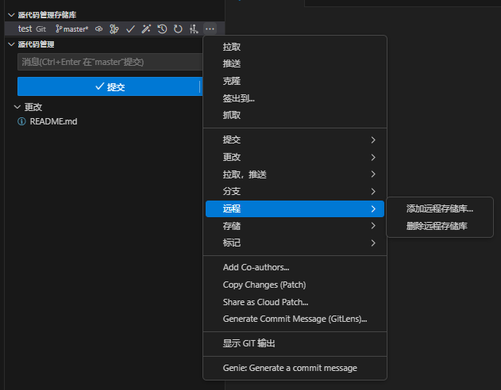

## 3.3 提交文件

1. 点击＋键，即可将文件追踪，暂存文件更改

   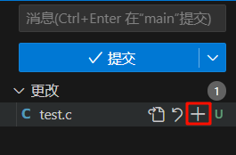

2. 暂存更改文件的状态，将从U (Untracked) 代表文件是是 **未跟踪** 的，变成 A (Added)，代表文件是 **新增** 的，还未提交

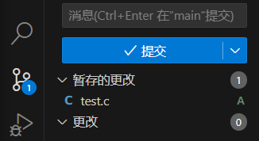

3. 在 **消息栏** 输入本次提交的注释，点击提交即完成文件的提交。必需要在消息栏填写内容才能提交，消息栏是用来描述你的代码变化的目的和内容的地方，方便进行浏览版本差异


> VScode文件右侧字母含义：
>
> 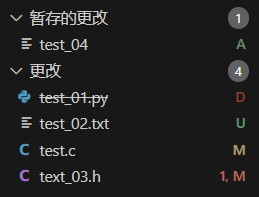
>
> - **A**：**A**是**Added**的缩写。表示这个文件是**新增**的，它在本地仓库中不存在，但是已经被添加到暂存区，等待提交。
> - **U**：**U**是**Untracked**的缩写。表示这个文件是**未跟踪**的，它在本地仓库中不存在，也没有被添加到暂存区，需要你手动添加或忽略。
> - **M**：**M**是**Modified**的缩写。表示这个文件是**被修改**的，它在本地仓库中存在，但是已经被修改。
> - **D**：**D**是**Deleted**的缩写。表示这个文件是**被删除**的，它在本地仓库中存在，但是已经被删除。
> - **1,M**：表示这个文件**有一个错误**，后面的字母代表该文件的状态。

## 3.4 历史版本

1. 点击顶端 `view history` 按钮，即可看见所有上传的版本（没有可以去扩展安装`Git History`）。

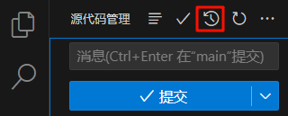

2. 在`Git History`界面可以看见所有历史版本信息，左侧有版本名称即为你添加的注释（可以相同）和上传时间，右侧有版本的hash码（不同），是版本的唯一标识符。

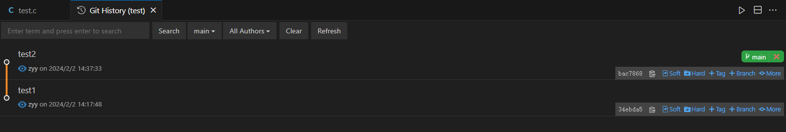

3. 点击版本，可以看到该版本相比上一版本进行了哪些操作。可以看到test7版本，相比于test6版本，添加了`test_02.txt`、删除了`text_03.h`，修改了`test.c`

   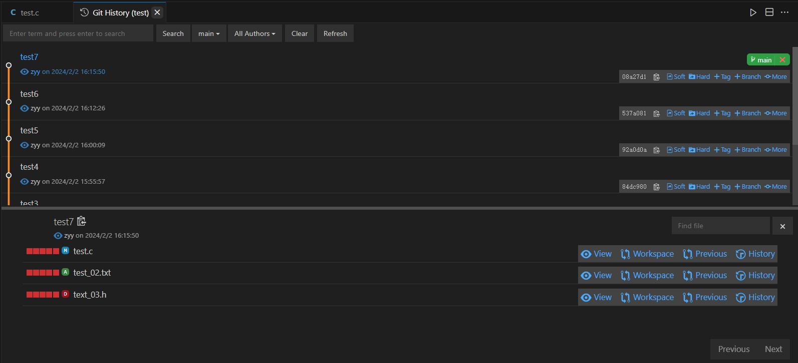

   - 点击 `view`，可以看到该版本的该文件的内容。

     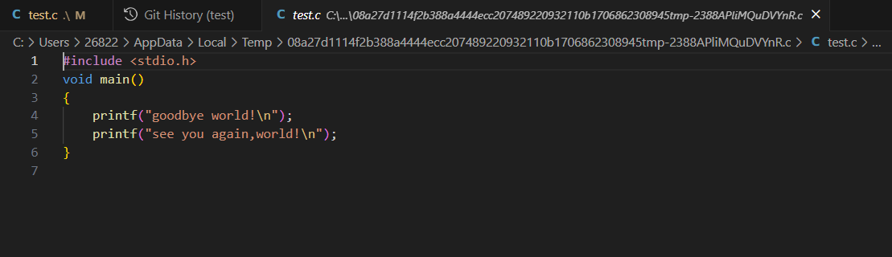

   - 点击 `Workspace`，可以看到该版本与 **当前工作空间内容** 的对比

     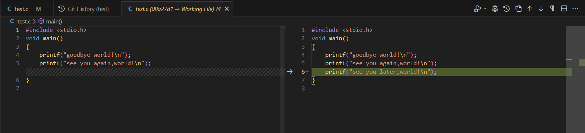

   - 点击 `Previous` ，可以看到该版本与 **上一版本文件内容** 的对比

     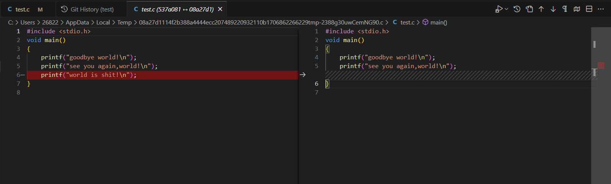

   - 点击 `History` ，可以看到该文件 所有被修改的历史版本

     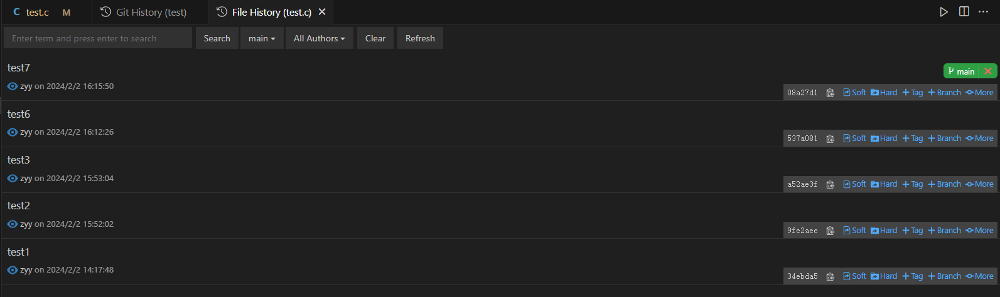

4. **版本对比**

   当点击右侧时间线，可以对比提交的版本与当前版本的区别。左侧为对比的版本，右侧为当前版本，**红色**为当前版本**删除的部分**，**绿色**为当前版本**添加的部分**

   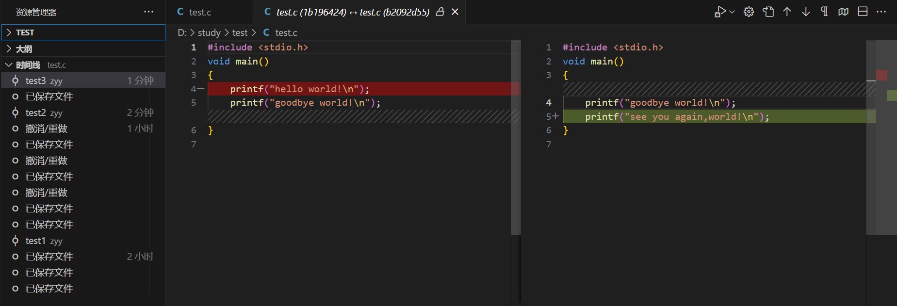


